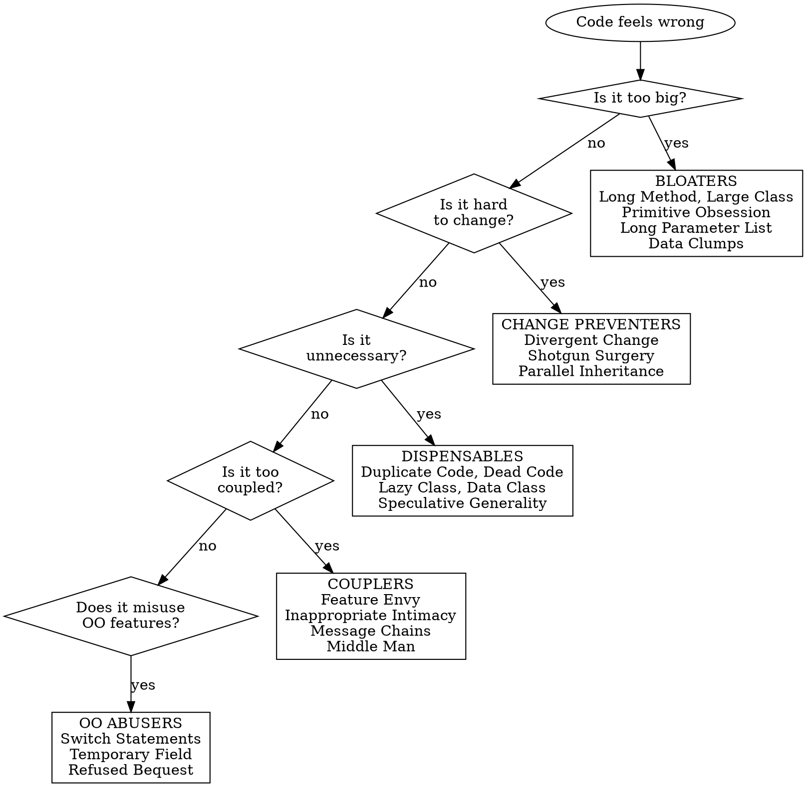

# Detect Code Smells

## Overview

Code smells are surface indicators of deeper structural problems. They don't cause bugs directly but signal design weaknesses that slow development and increase bug risk. Detecting smells is the first step before applying targeted refactoring.

## When to Use

- Code review reveals hard-to-read or hard-to-change sections
- A class or method has grown significantly over time
- Adding a feature requires touching many unrelated files
- Copy-pasted logic across the codebase
- Tests are brittle or hard to write for a module

## Quick Reference

| Category | Smell | Key Symptom | Primary Fix (Skill) |
|----------|-------|-------------|---------------------|
| **Bloaters** | Long Method | Method > 20 lines doing multiple things | `refactor-composing-methods` |
| **Bloaters** | Large Class | Too many fields/methods/lines | `refactor-moving-features` |
| **Bloaters** | Primitive Obsession | Primitives instead of small objects | `refactor-organizing-data` |
| **Bloaters** | Long Parameter List | 4+ parameters | `refactor-simplifying-method-calls` |
| **Bloaters** | Data Clumps | Same variables appear together repeatedly | `refactor-organizing-data` |
| **OO Abusers** | Switch Statements | Complex switch/if-else on type codes | `refactor-simplifying-conditionals` |
| **OO Abusers** | Temporary Field | Fields only set in certain circumstances | `refactor-organizing-data` |
| **OO Abusers** | Refused Bequest | Subclass uses little of parent's interface | `refactor-generalization` |
| **OO Abusers** | Alternative Classes w/ Different Interfaces | Same thing, different method names | `refactor-generalization` |
| **Change Preventers** | Divergent Change | One class changed for many different reasons | `refactor-moving-features` |
| **Change Preventers** | Shotgun Surgery | One change requires edits across many classes | `refactor-moving-features` |
| **Change Preventers** | Parallel Inheritance Hierarchies | Adding subclass in one hierarchy requires another | `refactor-generalization` |
| **Dispensables** | Comments (excessive) | Code needs extensive comments to be understood | `refactor-composing-methods` |
| **Dispensables** | Duplicate Code | Identical or similar code in multiple places | `refactor-composing-methods` |
| **Dispensables** | Lazy Class | Class does too little to justify existence | `refactor-moving-features` |
| **Dispensables** | Data Class | Only fields and getters/setters, no behavior | `refactor-organizing-data` |
| **Dispensables** | Dead Code | Unreachable or unused code | `refactor-composing-methods` |
| **Dispensables** | Speculative Generality | Unused abstractions "just in case" | `refactor-generalization` |
| **Couplers** | Feature Envy | Method uses another class's data more than its own | `refactor-moving-features` |
| **Couplers** | Inappropriate Intimacy | Classes access each other's internals excessively | `refactor-moving-features` |
| **Couplers** | Message Chains | `a.getB().getC().getD()` chains | `refactor-moving-features` |
| **Couplers** | Middle Man | Class delegates most work to another class | `refactor-moving-features` |
| **Couplers** | Incomplete Library Class | Library doesn't provide needed functionality | `refactor-moving-features` |

## Detailed Smell Catalog

### Bloaters

#### Long Method
- **Severity**: HIGH — most common smell, gateway to others
- **Fix**: Extract Method, Replace Temp with Query, Replace Method with Method Object -> `refactor-composing-methods`

#### Large Class
- **Severity**: HIGH — leads to Divergent Change, impossible to test in isolation
- **Fix**: Extract Class, Extract Subclass -> `refactor-moving-features`

#### Primitive Obsession
- **Severity**: MEDIUM — worsens as validation logic scatters
- **Fix**: Replace Data Value with Object, Replace Type Code with Class/Subclasses/State-Strategy -> `refactor-organizing-data`

#### Long Parameter List
- **Severity**: MEDIUM — hard to understand and call correctly
- **Fix**: Replace Parameter with Method Call, Preserve Whole Object, Introduce Parameter Object -> `refactor-simplifying-method-calls`

#### Data Clumps
- **Severity**: MEDIUM — indicates a missing abstraction
- **Fix**: Extract Class, Introduce Parameter Object -> `refactor-organizing-data`

### Object-Orientation Abusers

#### Switch Statements
- **Severity**: HIGH when duplicated — polymorphism should eliminate this
- **Fix**: Replace Conditional with Polymorphism, Replace Type Code with State/Strategy -> `refactor-simplifying-conditionals`

#### Temporary Field
- **Severity**: MEDIUM — confusing because you expect all fields to be meaningful
- **Fix**: Extract Class, Introduce Null Object -> `refactor-organizing-data`

#### Refused Bequest
- **Severity**: MEDIUM-HIGH — violates Liskov Substitution Principle
- **Fix**: Replace Inheritance with Delegation, Extract Superclass -> `refactor-generalization`

#### Alternative Classes with Different Interfaces
- **Severity**: LOW-MEDIUM
- **Fix**: Rename Method, Extract Superclass -> `refactor-generalization`

### Change Preventers

#### Divergent Change
- **Severity**: HIGH — each change risks breaking unrelated functionality (SRP violation)
- **Fix**: Extract Class -> `refactor-moving-features`

#### Shotgun Surgery
- **Severity**: HIGH — easy to miss one required change, causing bugs
- **Fix**: Move Method, Move Field, Inline Class -> `refactor-moving-features`

#### Parallel Inheritance Hierarchies
- **Severity**: MEDIUM — special case of Shotgun Surgery
- **Fix**: Move Method, Move Field to collapse one hierarchy -> `refactor-generalization`

### Dispensables

#### Comments (Excessive)
- **Severity**: LOW as a smell itself, but signals underlying complexity
- **Fix**: Extract Method (comment becomes the method name), Rename Method -> `refactor-composing-methods`

#### Duplicate Code
- **Severity**: HIGH — every bug fix must be applied in every copy
- **Fix**: Extract Method, Pull Up Method, Form Template Method -> `refactor-composing-methods` and `refactor-generalization`

#### Lazy Class
- **Severity**: LOW — costs comprehension without adding value
- **Fix**: Inline Class, Collapse Hierarchy -> `refactor-moving-features`

#### Data Class
- **Severity**: MEDIUM — indicates Feature Envy in consuming classes
- **Fix**: Move Method (move behavior into the data class), Encapsulate Field -> `refactor-organizing-data`

#### Dead Code
- **Severity**: LOW but cumulative
- **Fix**: Delete it. Use tooling to verify it's truly unreachable -> `refactor-composing-methods`

#### Speculative Generality
- **Severity**: LOW-MEDIUM — YAGNI violation
- **Fix**: Collapse Hierarchy, Inline Class, Remove Parameter -> `refactor-generalization`

### Couplers

#### Feature Envy
- **Severity**: HIGH — fundamental misplacement of responsibility
- **Fix**: Move Method, Extract Method -> `refactor-moving-features`

#### Inappropriate Intimacy
- **Severity**: HIGH — makes both classes impossible to change independently
- **Fix**: Move Method, Move Field, Extract Class, Hide Delegate -> `refactor-moving-features`

#### Message Chains
- **Severity**: MEDIUM — fragile and hard to test
- **Fix**: Hide Delegate, Extract Method, Move Method -> `refactor-moving-features`

#### Middle Man
- **Severity**: LOW-MEDIUM — adds indirection without value
- **Fix**: Remove Middle Man, Inline Method -> `refactor-moving-features`

#### Incomplete Library Class
- **Severity**: LOW — a constraint, not a design flaw
- **Fix**: Introduce Foreign Method, Introduce Local Extension -> `refactor-moving-features`

## Detection Flowchart

## Common Mistakes

| Mistake | Fix |
|---------|-----|
| Treating every smell as equally urgent | Prioritize by severity (HIGH first) and frequency |
| Refactoring without tests in place | Always ensure test coverage before refactoring |
| Trying to fix all smells at once | Fix one smell at a time, run tests between each change |
| Creating new smells while fixing old ones | E.g., extracting a method but creating a Long Parameter List |
| Ignoring smells in "working" code | Technical debt compounds -- address during related feature work |
