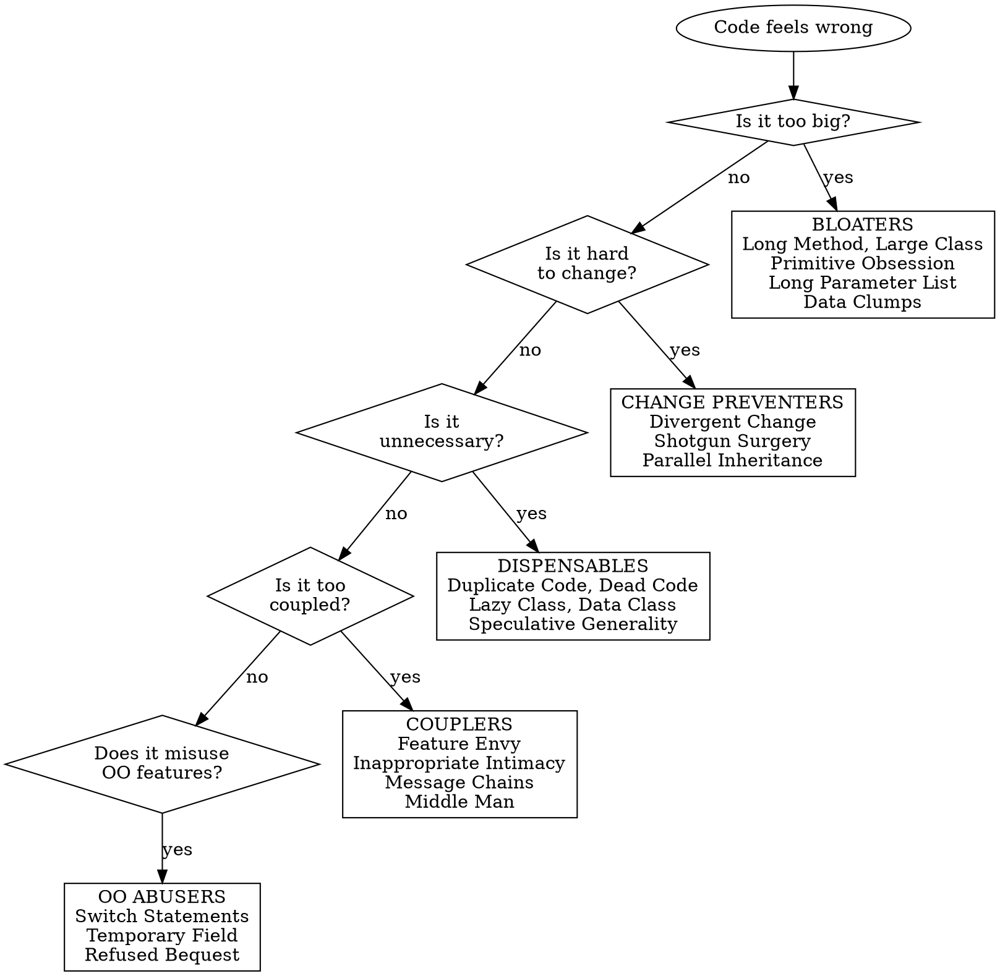

# Detect Code Smells

## Overview

Code smells are surface indicators of deeper structural problems. They don't cause bugs directly but signal design weaknesses that slow development, increase bug risk, and make code harder to maintain. Detecting smells is the first step before applying targeted refactoring techniques.

## When to Use

- Code review reveals hard-to-read or hard-to-change sections
- A class or method has grown significantly over time
- Adding a feature requires touching many unrelated files
- You notice copy-pasted logic across the codebase
- Tests are brittle or hard to write for a module

## Quick Reference

| Category | Smell | Key Symptom | Primary Fix (Skill) |
|----------|-------|-------------|---------------------|
| **Bloaters** | Long Method | Method > 20 lines doing multiple things | `refactor-composing-methods` |
| **Bloaters** | Large Class | Class with too many fields/methods/lines | `refactor-moving-features` |
| **Bloaters** | Primitive Obsession | Using primitives instead of small objects | `refactor-organizing-data` |
| **Bloaters** | Long Parameter List | Method takes 4+ parameters | `refactor-simplifying-method-calls` |
| **Bloaters** | Data Clumps | Same group of variables appears together repeatedly | `refactor-organizing-data` |
| **OO Abusers** | Switch Statements | Complex switch/if-else on type codes | `refactor-simplifying-conditionals` |
| **OO Abusers** | Temporary Field | Fields only set in certain circumstances | `refactor-organizing-data` |
| **OO Abusers** | Refused Bequest | Subclass uses little of parent's interface | `refactor-generalization` |
| **OO Abusers** | Alternative Classes with Different Interfaces | Classes do same thing with different method names | `refactor-generalization` |
| **Change Preventers** | Divergent Change | One class changed for many different reasons | `refactor-moving-features` |
| **Change Preventers** | Shotgun Surgery | One change requires edits across many classes | `refactor-moving-features` |
| **Change Preventers** | Parallel Inheritance Hierarchies | Adding subclass in one hierarchy requires adding in another | `refactor-generalization` |
| **Dispensables** | Comments (excessive) | Code needs extensive comments to be understood | `refactor-composing-methods` |
| **Dispensables** | Duplicate Code | Identical or very similar code in multiple places | `refactor-composing-methods` |
| **Dispensables** | Lazy Class | Class that does too little to justify its existence | `refactor-moving-features` |
| **Dispensables** | Data Class | Class with only fields and getters/setters, no behavior | `refactor-organizing-data` |
| **Dispensables** | Dead Code | Unreachable or unused code | `refactor-composing-methods` |
| **Dispensables** | Speculative Generality | Unused abstractions created "just in case" | `refactor-generalization` |
| **Couplers** | Feature Envy | Method uses another class's data more than its own | `refactor-moving-features` |
| **Couplers** | Inappropriate Intimacy | Classes access each other's internals excessively | `refactor-moving-features` |
| **Couplers** | Message Chains | `a.getB().getC().getD()` chains | `refactor-moving-features` |
| **Couplers** | Middle Man | Class delegates most work to another class | `refactor-moving-features` |
| **Couplers** | Incomplete Library Class | Library doesn't provide needed functionality | `refactor-moving-features` |

## Detailed Smell Catalog

### Category 1: Bloaters

Bloaters are code elements that have grown so large they become hard to work with.

#### Long Method
- **Symptoms**: Method body exceeds ~20 lines; multiple levels of indentation; comments explaining sections of the method; method name doesn't capture everything it does
- **Why it happens**: It's easier to add a line than to create a new method. Over time, the method accumulates responsibilities
- **Severity**: HIGH — long methods are the most common smell and a gateway to other smells
- **Fix**: Extract Method, Replace Temp with Query, Replace Method with Method Object → see `refactor-composing-methods`

#### Large Class
- **Symptoms**: Class has 10+ fields; class has 20+ methods; class name includes "Manager", "Processor", "Handler" with broad scope; class has multiple unrelated groups of methods
- **Why it happens**: Features keep getting added to the "obvious" class rather than creating focused ones
- **Severity**: HIGH — leads to Divergent Change and makes the class impossible to test in isolation
- **Fix**: Extract Class, Extract Subclass → see `refactor-moving-features`

#### Primitive Obsession
- **Symptoms**: Using strings for phone numbers, zip codes, currency; integer constants for type codes; string field names for array indexes
- **Why it happens**: Creating a small class feels like overkill, so primitives are used as shortcuts
- **Severity**: MEDIUM — grows worse over time as validation logic scatters
- **Fix**: Replace Data Value with Object, Replace Type Code with Class/Subclasses/State-Strategy → see `refactor-organizing-data`

#### Long Parameter List
- **Symptoms**: Method takes 4+ parameters; parameters are often passed together; boolean flag parameters that switch behavior
- **Why it happens**: Parameters added incrementally to avoid creating dependencies between classes
- **Severity**: MEDIUM — makes methods hard to understand and call correctly
- **Fix**: Replace Parameter with Method Call, Preserve Whole Object, Introduce Parameter Object → see `refactor-simplifying-method-calls`

#### Data Clumps
- **Symptoms**: Same 3+ variables appear together in multiple method signatures or classes (e.g., `startDate`, `endDate`, `timezone`)
- **Why it happens**: Related data never gets formalized into its own structure
- **Severity**: MEDIUM — indicates a missing abstraction
- **Fix**: Extract Class, Introduce Parameter Object → see `refactor-organizing-data`

### Category 2: Object-Orientation Abusers

These smells indicate incomplete or incorrect use of OO principles.

#### Switch Statements
- **Symptoms**: Same switch/if-else chain appears in multiple places; switching on a type code or class name; adding a new type requires updating multiple switch statements
- **Why it happens**: Procedural thinking applied in an OO context
- **Severity**: HIGH when duplicated across methods — the whole point of polymorphism is to eliminate this
- **Fix**: Replace Conditional with Polymorphism, Replace Type Code with State/Strategy → see `refactor-simplifying-conditionals`

#### Temporary Field
- **Symptoms**: Object fields only populated under certain conditions; null checks scattered around field usage; fields set in one method and used in another unrelated method
- **Why it happens**: Fields added to avoid passing parameters between methods within a class
- **Severity**: MEDIUM — confusing because you expect all fields to be meaningful
- **Fix**: Extract Class, Introduce Null Object → see `refactor-organizing-data`

#### Refused Bequest
- **Symptoms**: Subclass overrides parent methods to throw exceptions or no-op; subclass only uses a fraction of inherited interface; `instanceof` checks in code that receives the parent type
- **Why it happens**: Inheritance used for code reuse rather than true "is-a" relationships
- **Severity**: MEDIUM-HIGH — violates Liskov Substitution Principle
- **Fix**: Replace Inheritance with Delegation, Extract Superclass → see `refactor-generalization`

#### Alternative Classes with Different Interfaces
- **Symptoms**: Two classes do the same thing but have different method names; client code has adapters or wrappers to unify their interfaces
- **Why it happens**: Developers unaware of each other's work, or organic evolution of similar functionality
- **Severity**: LOW-MEDIUM — wastes effort and creates confusion
- **Fix**: Rename Method, Extract Superclass → see `refactor-generalization`

### Category 3: Change Preventers

These smells make modifications difficult, requiring changes in many places for a single logical change.

#### Divergent Change
- **Symptoms**: One class is modified for completely different reasons (e.g., changed when DB schema changes AND when UI requirements change); class has methods that cluster into unrelated groups
- **Why it happens**: Violation of Single Responsibility Principle — too many concerns in one class
- **Severity**: HIGH — each change risks breaking unrelated functionality
- **Fix**: Extract Class → see `refactor-moving-features`

#### Shotgun Surgery
- **Symptoms**: A single logical change requires small edits in many classes; adding a field means updating 5+ files; "I changed X and also had to update A, B, C, D, E"
- **Why it happens**: Responsibility is split too finely across classes, or a cross-cutting concern isn't centralized
- **Severity**: HIGH — easy to miss one of the required changes, causing bugs
- **Fix**: Move Method, Move Field, Inline Class → see `refactor-moving-features`

#### Parallel Inheritance Hierarchies
- **Symptoms**: Every time you add a subclass to hierarchy A, you must add one to hierarchy B; class name prefixes mirror each other across hierarchies
- **Why it happens**: Hierarchies that started independent grew coupled over time
- **Severity**: MEDIUM — special case of Shotgun Surgery
- **Fix**: Move Method, Move Field to collapse one hierarchy → see `refactor-generalization`

### Category 4: Dispensables

Code that is pointless and should be removed to make the codebase cleaner.

#### Comments (Excessive)
- **Symptoms**: Method has a block comment explaining what each section does; comments describe "what" not "why"; commented-out code left "just in case"
- **Why it happens**: Code is too complex to understand without explanation
- **Severity**: LOW as a smell itself, but signals underlying complexity
- **Fix**: Extract Method (the comment becomes the method name), Rename Method → see `refactor-composing-methods`

#### Duplicate Code
- **Symptoms**: Identical or near-identical blocks in multiple methods; same algorithm implemented slightly differently in sibling classes; utility functions reimplemented across modules
- **Why it happens**: Copy-paste development, lack of awareness of existing code
- **Severity**: HIGH — every bug fix must be applied in every copy
- **Fix**: Extract Method, Pull Up Method, Form Template Method → see `refactor-composing-methods` and `refactor-generalization`

#### Lazy Class
- **Symptoms**: Class has 1-2 methods; class was planned for future growth that never happened; class exists only to hold a single field
- **Why it happens**: Over-engineering, or class lost responsibility during refactoring
- **Severity**: LOW — costs comprehension without adding value
- **Fix**: Inline Class, Collapse Hierarchy → see `refactor-moving-features`

#### Data Class
- **Symptoms**: Class has only fields and getters/setters; no business logic; other classes manipulate its data extensively
- **Why it happens**: Anemic domain model — behavior lives in service classes instead of domain objects
- **Severity**: MEDIUM — indicates Feature Envy in the classes that use it
- **Fix**: Move Method (move behavior into the data class), Encapsulate Field → see `refactor-organizing-data`

#### Dead Code
- **Symptoms**: Unreachable branches; unused variables, parameters, or methods; code behind feature flags that were never cleaned up
- **Why it happens**: Features removed or changed without cleaning up old paths
- **Severity**: LOW but cumulative — adds noise and confusion
- **Fix**: Delete it. Use IDE/tooling to verify it's truly unreachable → see `refactor-composing-methods`

#### Speculative Generality
- **Symptoms**: Abstract classes with only one concrete subclass; parameters or methods that exist "for future use"; unnecessary delegation layers
- **Why it happens**: Over-anticipating future needs (YAGNI violation)
- **Severity**: LOW-MEDIUM — adds complexity without current benefit
- **Fix**: Collapse Hierarchy, Inline Class, Remove Parameter → see `refactor-generalization`

### Category 5: Couplers

These smells indicate excessive coupling between classes.

#### Feature Envy
- **Symptoms**: A method calls 4+ methods on another object; method accesses more data from another class than its own; method could be moved to the other class and would need fewer parameters
- **Why it happens**: Behavior placed in the wrong class
- **Severity**: HIGH — fundamental misplacement of responsibility
- **Fix**: Move Method, Extract Method → see `refactor-moving-features`

#### Inappropriate Intimacy
- **Symptoms**: Classes access each other's private fields (via reflection or friend access); bidirectional dependencies; classes that always change together
- **Why it happens**: Classes evolved together without clear boundaries
- **Severity**: HIGH — makes both classes impossible to change independently
- **Fix**: Move Method, Move Field, Extract Class, Hide Delegate → see `refactor-moving-features`

#### Message Chains
- **Symptoms**: `client.getAccount().getOwner().getAddress().getCity()` — navigation through object graph; if any intermediate object changes, the chain breaks
- **Why it happens**: Client knows too much about the object structure
- **Severity**: MEDIUM — fragile and hard to test
- **Fix**: Hide Delegate, Extract Method, Move Method → see `refactor-moving-features`

#### Middle Man
- **Symptoms**: Class where majority of methods just delegate to another class; thin wrapper with no added value; every new feature on the delegate requires updating the middle man
- **Why it happens**: Over-application of Hide Delegate, or defensive layering
- **Severity**: LOW-MEDIUM — adds indirection without value
- **Fix**: Remove Middle Man, Inline Method → see `refactor-moving-features`

#### Incomplete Library Class
- **Symptoms**: You need functionality the library doesn't provide; you're working around library limitations with utility classes; you'd modify the library source if you could
- **Why it happens**: Libraries can't anticipate every use case
- **Severity**: LOW — it's a constraint, not a design flaw
- **Fix**: Introduce Foreign Method, Introduce Local Extension → see `refactor-moving-features`

## Detection Flowchart

## Common Mistakes

| Mistake | Fix |
|---------|-----|
| Treating every smell as equally urgent | Prioritize by severity (HIGH first) and frequency |
| Refactoring without tests in place | Always ensure test coverage before refactoring |
| Trying to fix all smells at once | Fix one smell at a time, run tests between each change |
| Creating new smells while fixing old ones | E.g., extracting a method but creating a Long Parameter List — address both |
| Ignoring smells in "working" code | Technical debt compounds — address smells during related feature work |
