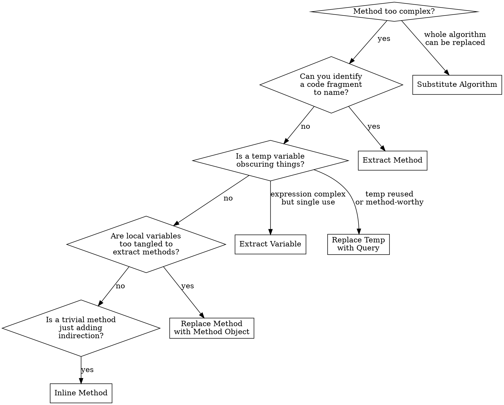

# Refactor: Composing Methods

## Overview

These 9 techniques break down complex methods into smaller, more readable pieces and eliminate code duplication. They are the most frequently used refactoring techniques and the first line of defense against Bloater smells.

## When to Use

- Method exceeds ~20 lines
- Method has comments explaining sections (each section should be its own method)
- Same code block appears in multiple places
- Complex expressions are hard to understand at a glance
- Temporary variables accumulate and obscure logic
- A method does too much to be replaced by simpler extraction

## Quick Reference

| Technique | Problem | Solution | Key Steps |
|-----------|---------|----------|-----------|
| Extract Method | Code fragment that can be grouped | Move fragment into a named method | 1. Create method 2. Copy code 3. Pass needed locals as params 4. Replace original with call |
| Inline Method | Method body is as clear as its name | Replace calls with method body | 1. Check not polymorphic 2. Find all calls 3. Replace with body 4. Delete method |
| Extract Variable | Complex expression hard to understand | Put expression result in a descriptive variable | 1. Create variable 2. Replace expression with variable 3. Use variable everywhere the expression appears |
| Inline Temp | Temp assigned once from simple expression | Replace temp references with the expression | 1. Verify single assignment 2. Replace all reads with expression 3. Delete temp |
| Replace Temp with Query | Temp holds result of an expression | Extract expression into a method | 1. Extract expression to method 2. Replace temp with method call 3. Remove temp declaration |
| Split Temporary Variable | Temp assigned more than once (not a loop var) | Create separate variable for each assignment | 1. Rename first assignment 2. Make it const/final 3. Repeat for each reassignment |
| Remove Assignments to Parameters | Method assigns to its parameters | Use a local variable instead | 1. Create local variable 2. Replace parameter assignments with local 3. Immutability preserved |
| Replace Method with Method Object | Long method with intertwined local variables that prevent extraction | Turn method into its own class | 1. Create class with same params as method 2. Move locals to fields 3. Extract sub-methods freely |
| Substitute Algorithm | Algorithm can be replaced with a clearer one | Replace the body with the better algorithm | 1. Write new algorithm 2. Run tests 3. Replace old with new |

## Techniques in Detail

### 1. Extract Method

The most important refactoring technique. When in doubt, extract.

**Before:**
```typescript
function printOwing(invoice: Invoice): void {
  let outstanding = 0;

  // print banner
  console.log("***********************");
  console.log("*** Customer Owes ***");
  console.log("***********************");

  // calculate outstanding
  for (const order of invoice.orders) {
    outstanding += order.amount;
  }

  // print details
  console.log(`name: ${invoice.customer}`);
  console.log(`amount: ${outstanding}`);
}
```

**After:**
```typescript
function printOwing(invoice: Invoice): void {
  printBanner();
  const outstanding = calculateOutstanding(invoice);
  printDetails(invoice, outstanding);
}

function printBanner(): void {
  console.log("***********************");
  console.log("*** Customer Owes ***");
  console.log("***********************");
}

function calculateOutstanding(invoice: Invoice): number {
  return invoice.orders.reduce((sum, order) => sum + order.amount, 0);
}

function printDetails(invoice: Invoice, outstanding: number): void {
  console.log(`name: ${invoice.customer}`);
  console.log(`amount: ${outstanding}`);
}
```

**Steps:**
1. Create a new method with a name that describes *what* it does (not *how*)
2. Copy the extracted code into the new method
3. Scan for local variables — pass as parameters or return as results
4. Replace original code with a call to the new method
5. Run tests

**Smells fixed:** Long Method, Duplicate Code, Comments (excessive)

### 2. Inline Method

The reverse of Extract Method — use when the method body is already perfectly clear.

**Before:**
```typescript
function getRating(driver: Driver): number {
  return moreThanFiveLateDeliveries(driver) ? 2 : 1;
}

function moreThanFiveLateDeliveries(driver: Driver): boolean {
  return driver.numberOfLateDeliveries > 5;
}
```

**After:**
```typescript
function getRating(driver: Driver): number {
  return driver.numberOfLateDeliveries > 5 ? 2 : 1;
}
```

**Steps:**
1. Check that the method isn't polymorphic (not overridden in subclasses)
2. Find all callers
3. Replace each call with the method body
4. Delete the method
5. Run tests

### 3. Extract Variable

**Before:**
```typescript
function price(order: Order): number {
  return order.quantity * order.itemPrice -
    Math.max(0, order.quantity - 500) * order.itemPrice * 0.05 +
    Math.min(order.quantity * order.itemPrice * 0.1, 100);
}
```

**After:**
```typescript
function price(order: Order): number {
  const basePrice = order.quantity * order.itemPrice;
  const quantityDiscount = Math.max(0, order.quantity - 500) * order.itemPrice * 0.05;
  const shipping = Math.min(basePrice * 0.1, 100);
  return basePrice - quantityDiscount + shipping;
}
```

**Smells fixed:** Long Method (complex expressions within)

### 4. Inline Temp / Replace Temp with Query

These two work together. Inline Temp removes a trivial temp; Replace Temp with Query promotes a meaningful expression to a reusable method.

**Replace Temp with Query — Before:**
```typescript
function calculateTotal(order: Order): number {
  const basePrice = order.quantity * order.itemPrice;
  if (basePrice > 1000) {
    return basePrice * 0.95;
  }
  return basePrice * 0.98;
}
```

**After:**
```typescript
function calculateTotal(order: Order): number {
  if (basePrice(order) > 1000) {
    return basePrice(order) * 0.95;
  }
  return basePrice(order) * 0.98;
}

function basePrice(order: Order): number {
  return order.quantity * order.itemPrice;
}
```

**When to use which:** If the expression is trivial and used once → Inline Temp. If the expression is meaningful and reusable → Replace Temp with Query.

### 5. Split Temporary Variable

**Before:**
```typescript
let temp = 2 * (height + width);
console.log(temp);
temp = height * width;
console.log(temp);
```

**After:**
```typescript
const perimeter = 2 * (height + width);
console.log(perimeter);
const area = height * width;
console.log(area);
```

**Smells fixed:** Confusing variable reuse — each variable should have exactly one responsibility.

### 6. Remove Assignments to Parameters

Critical for immutability (aligns with coding standards).

**Before:**
```typescript
function discount(inputVal: number, quantity: number): number {
  if (quantity > 50) inputVal -= 2;  // mutating parameter!
  return inputVal;
}
```

**After:**
```typescript
function discount(inputVal: number, quantity: number): number {
  const result = quantity > 50 ? inputVal - 2 : inputVal;
  return result;
}
```

### 7. Replace Method with Method Object

Use when Extract Method is impossible due to tangled local variables.

**Before:**
```typescript
class Order {
  price(): number {
    let primaryBasePrice: number;
    let secondaryBasePrice: number;
    let tertiaryBasePrice: number;
    // ... long computation using all three variables intertwined ...
  }
}
```

**After:**
```typescript
class PriceCalculator {
  constructor(
    private readonly order: Order,
    private primaryBasePrice: number = 0,
    private secondaryBasePrice: number = 0,
    private tertiaryBasePrice: number = 0
  ) {}

  compute(): number {
    this.calculatePrimary();
    this.calculateSecondary();
    this.calculateTertiary();
    return this.primaryBasePrice + this.secondaryBasePrice + this.tertiaryBasePrice;
  }

  // Now you can freely extract methods since fields replace locals
  private calculatePrimary(): void { /* ... */ }
  private calculateSecondary(): void { /* ... */ }
  private calculateTertiary(): void { /* ... */ }
}
```

### 8. Substitute Algorithm

Replace an algorithm with a simpler, clearer one.

**Before:**
```typescript
function foundPerson(people: string[]): string {
  for (let i = 0; i < people.length; i++) {
    if (people[i] === "Don") return "Don";
    if (people[i] === "John") return "John";
    if (people[i] === "Kent") return "Kent";
  }
  return "";
}
```

**After:**
```typescript
function foundPerson(people: string[]): string {
  const candidates = new Set(["Don", "John", "Kent"]);
  return people.find(p => candidates.has(p)) ?? "";
}
```

## Decision Flowchart



## Common Mistakes

| Mistake | Fix |
|---------|-----|
| Extracting methods that are too small (single-line getters) | Only extract when the name adds clarity beyond the code itself |
| Naming extracted methods by implementation (`calcStep1`) | Name by intent (`calculateDiscount`) |
| Extracting but creating Long Parameter Lists | If extraction needs 4+ params, consider Extract Class or Parameter Object |
| Inlining methods that are actually providing useful abstraction | Only inline when the body is as clear as the name |
| Forgetting to run tests after each extraction | Every refactoring step should be followed by a test run |
