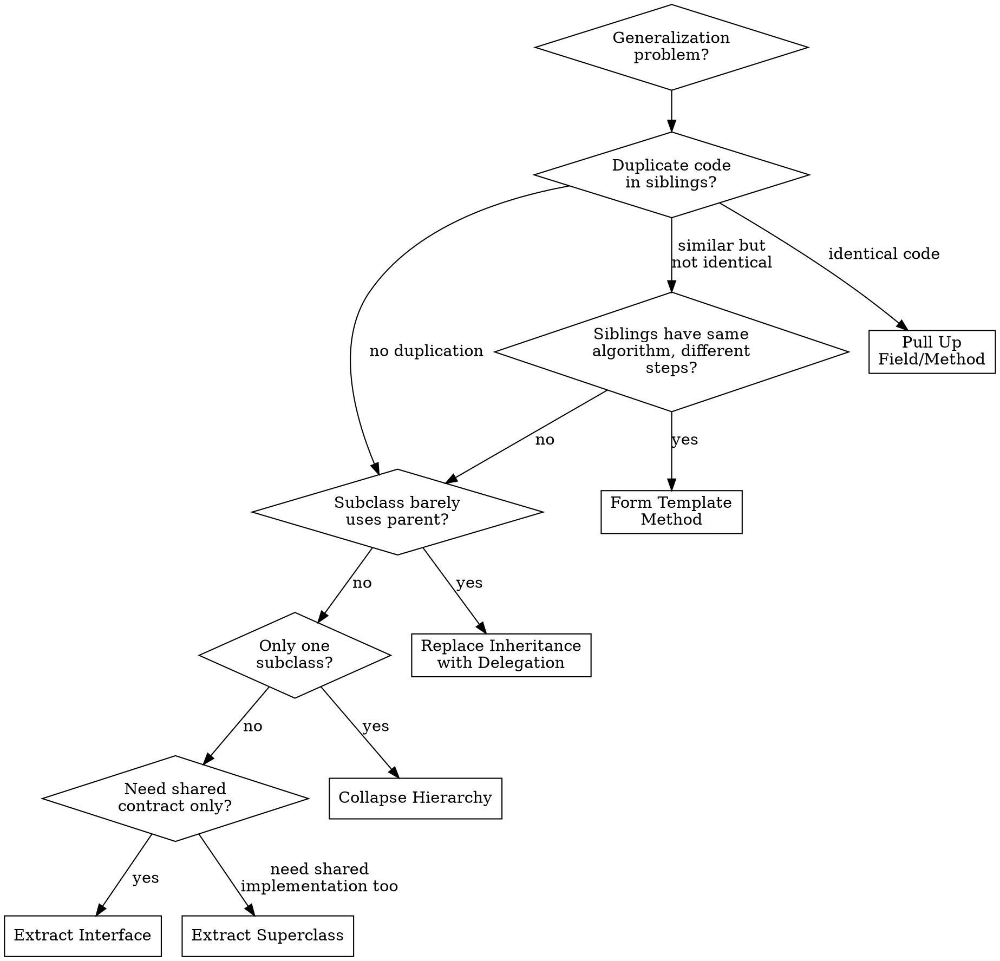

# Refactor: Dealing with Generalization

## Overview

These 12 techniques manage inheritance hierarchies — pulling shared behavior up, pushing specific behavior down, extracting common interfaces, and replacing inheritance with delegation (or vice versa). Correct generalization prevents code duplication across subclasses while avoiding over-engineering.

## When to Use

- Sibling classes share duplicate methods or fields
- Subclass only uses a fraction of parent's interface (Refused Bequest)
- Adding a subclass in one hierarchy requires adding one in another (Parallel Inheritance)
- Abstract class has only one concrete subclass (Speculative Generality)
- Inheritance used for code reuse rather than true is-a relationships

## Quick Reference

| Technique | Problem | Solution |
|-----------|---------|----------|
| Pull Up Field | Duplicate field in siblings | Move to superclass |
| Pull Up Method | Duplicate method in siblings | Move to superclass |
| Pull Up Constructor Body | Duplicate constructor code | Move shared init to super constructor |
| Push Down Method | Method only relevant to one subclass | Move from parent to subclass |
| Push Down Field | Field only used by one subclass | Move from parent to subclass |
| Extract Subclass | Features used only in some instances | Create subclass for special case |
| Extract Superclass | Two classes with similar features | Create parent with shared features |
| Extract Interface | Classes share partial interface | Create interface for shared protocol |
| Collapse Hierarchy | Subclass too similar to parent | Merge subclass into parent |
| Form Template Method | Same steps, different details | Template in parent, steps in subclasses |
| Replace Inheritance with Delegation | is-a doesn't hold | Hold parent as field, delegate |
| Replace Delegation with Inheritance | Delegates most calls, truly a subtype | Use inheritance instead |

## Techniques in Detail

### 1. Pull Up Field / Pull Up Method

**Before:**
```typescript
class Salesman {
  readonly name: string;
}

class Engineer {
  readonly name: string;
}
```

**After:**
```typescript
class Employee {
  readonly name: string;
}

class Salesman extends Employee { /* ... */ }
class Engineer extends Employee { /* ... */ }
```

**Pull Up Method steps:**
1. Inspect sibling methods for similarity
2. If identical, move to parent
3. If signatures differ, rename to match first
4. If bodies differ slightly, Extract Method to isolate differences, then Form Template Method
5. Run tests

### 2. Pull Up Constructor Body

**Before:**
```typescript
class Manager extends Employee {
  constructor(name: string, id: string, readonly grade: number) {
    super();
    this._name = name;
    this._id = id;
  }
}

class Engineer extends Employee {
  constructor(name: string, id: string, readonly specialty: string) {
    super();
    this._name = name;
    this._id = id;
  }
}
```

**After:**
```typescript
class Employee {
  constructor(
    protected readonly _name: string,
    protected readonly _id: string
  ) {}
}

class Manager extends Employee {
  constructor(name: string, id: string, readonly grade: number) {
    super(name, id);
  }
}

class Engineer extends Employee {
  constructor(name: string, id: string, readonly specialty: string) {
    super(name, id);
  }
}
```

### 3. Push Down Method / Push Down Field

**Before:**
```typescript
class Employee {
  getQuota(): number { /* only relevant to Salesman */ }
}
```

**After:**
```typescript
class Salesman extends Employee {
  getQuota(): number { /* ... */ }
}
```

Push down when the feature doesn't apply to all subtypes and causes Refused Bequest in other subclasses.

### 4. Extract Subclass

**Before:**
```typescript
class JobItem {
  getTotalPrice(): number {
    return this.unitPrice * this.quantity;
  }
  getUnitPrice(): number {
    return this.isLabor ? this.employee.rate : this.unitPrice;
  }
}
```

**After:**
```typescript
class JobItem {
  getTotalPrice(): number {
    return this.getUnitPrice() * this.quantity;
  }
  getUnitPrice(): number {
    return this.unitPrice;
  }
}

class LaborItem extends JobItem {
  getUnitPrice(): number {
    return this.employee.rate;
  }
}
```

### 5. Extract Superclass

**Before:**
```typescript
class Department {
  getTotalAnnualCost(): number {
    return this.staff.reduce((sum, e) => sum + e.annualCost, 0);
  }
  getHeadCount(): number { return this.staff.length; }
  readonly name: string;
}

class Employee {
  getAnnualCost(): number { return this.monthlySalary * 12; }
  readonly name: string;
  readonly id: string;
}
```

**After:**
```typescript
abstract class Party {
  readonly name: string;
  abstract getAnnualCost(): number;
}

class Department extends Party {
  getAnnualCost(): number {
    return this.staff.reduce((sum, e) => sum + e.getAnnualCost(), 0);
  }
}

class Employee extends Party {
  getAnnualCost(): number { return this.monthlySalary * 12; }
}
```

### 6. Extract Interface

Less invasive than Extract Superclass — use when you only need the contract, not shared implementation.

```typescript
interface Billable {
  getRate(): number;
  hasSpecialSkill(): boolean;
}

class Employee implements Billable {
  getRate(): number { return this.monthlySalary; }
  hasSpecialSkill(): boolean { return this.certifications.length > 0; }
}

class Contractor implements Billable {
  getRate(): number { return this.hourlyRate * 160; }
  hasSpecialSkill(): boolean { return this.specializations.length > 0; }
}
```

**Interface vs Superclass:** Interface when classes share a contract but not implementation. Superclass when they share both.

### 7. Collapse Hierarchy

When a subclass isn't different enough from its parent: choose which to remove (usually subclass), Pull Up or Push Down all members, update references, delete the empty class, run tests.

### 8. Form Template Method

**Before:**
```typescript
class TextStatement {
  value(customer: Customer): string {
    let result = header(customer);
    result += bodyText(customer);  // text-specific
    result += footer(customer);
    return result;
  }
}

class HtmlStatement {
  value(customer: Customer): string {
    let result = header(customer);
    result += bodyHtml(customer);  // html-specific
    result += footer(customer);
    return result;
  }
}
```

**After:**
```typescript
abstract class Statement {
  value(customer: Customer): string {
    let result = this.header(customer);
    result += this.body(customer);
    result += this.footer(customer);
    return result;
  }

  protected abstract body(customer: Customer): string;
  protected header(customer: Customer): string { /* shared */ }
  protected footer(customer: Customer): string { /* shared */ }
}

class TextStatement extends Statement {
  protected body(customer: Customer): string { /* text-specific */ }
}

class HtmlStatement extends Statement {
  protected body(customer: Customer): string { /* html-specific */ }
}
```

### 9. Replace Inheritance with Delegation

The most important technique here. Use when inheritance is abused for code reuse rather than a true "is-a" relationship.

**Before:**
```typescript
class Stack<T> extends Array<T> {
  push(item: T): number { return super.push(item); }
  pop(): T | undefined { return super.pop(); }
  // But Stack inherits sort, splice, slice, etc. — not appropriate!
}
```

**After:**
```typescript
class Stack<T> {
  private readonly items: T[] = [];

  push(item: T): Stack<T> {
    return Object.assign(new Stack<T>(), { items: [...this.items, item] });
  }

  pop(): { value: T | undefined; stack: Stack<T> } {
    const items = [...this.items];
    const value = items.pop();
    return { value, stack: Object.assign(new Stack<T>(), { items }) };
  }

  peek(): T | undefined {
    return this.items[this.items.length - 1];
  }
}
```

**Signals to use delegation:** subclass uses few parent methods, overrides many to throw/no-op, "is-a" test fails, or you want a restricted interface.

### 10. Replace Delegation with Inheritance

The reverse — when delegation is excessive and the object truly IS the delegate type. Apply when you're delegating almost every method, the object is a specialized version of the delegate, and there's no need to restrict the interface.

## Decision Flowchart



## Common Mistakes

| Mistake | Fix |
|---------|-----|
| Pulling up methods that aren't truly shared | Only pull up when ALL subclasses need it — otherwise push down |
| Using inheritance for code reuse when "is-a" doesn't hold | Default to delegation; use inheritance only for true subtypes |
| Creating deep hierarchies (>3 levels) | Flatten with delegation or composition |
| Extracting superclass too early (one known subclass) | Wait for the second case (rule of three) |
| Form Template Method with too many abstract steps | If more than 3-4 steps differ, the algorithm isn't truly shared |
| Collapsing hierarchy when subclass has meaningful behavioral differences | Only collapse if subclass adds no unique behavior |
