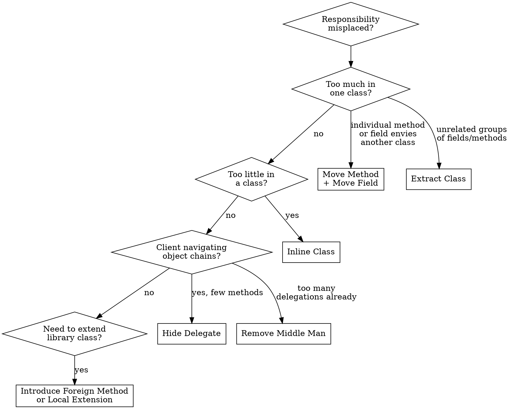

# Refactor: Moving Features Between Objects

## Overview

These 8 techniques redistribute responsibilities between classes. They address the fundamental OO question: "Which class should own this behavior?" Moving features correctly reduces coupling, increases cohesion, and makes each class focused on a single responsibility.

## When to Use

- A method uses more data from another class than its own (Feature Envy)
- A class has grown too large with unrelated responsibilities (Large Class, Divergent Change)
- A class is too thin to justify its existence (Lazy Class)
- One change requires edits in many classes (Shotgun Surgery)
- Client code navigates through object chains (Message Chains)
- Classes access each other's internals (Inappropriate Intimacy)

## Quick Reference

| Technique | Problem | Solution | Key Steps |
|-----------|---------|----------|-----------|
| Move Method | Method uses another class more than its own | Move it to the class it envies | 1. Copy method to target 2. Adjust for new context 3. Redirect or remove original |
| Move Field | Field used more by another class | Move it to the class that uses it most | 1. Create field in target 2. Update all references 3. Remove from source |
| Extract Class | One class doing the work of two | Split into two focused classes | 1. Identify cohesive subset 2. Create new class 3. Move fields/methods 4. Establish link |
| Inline Class | Class does too little | Merge into another class | 1. Move all features to absorbing class 2. Delete empty class |
| Hide Delegate | Client calls through an object to reach another | Create delegating methods on the first object | 1. Add method on server 2. Client calls server directly 3. No more chain |
| Remove Middle Man | Class has too many delegating methods | Let client call delegate directly | 1. Create accessor for delegate 2. Client uses delegate directly 3. Remove delegating methods |
| Introduce Foreign Method | Need a method on a library class you can't modify | Create a utility method with the class as first parameter | 1. Create method in client 2. Pass library instance as param |
| Introduce Local Extension | Need several methods on a library class | Create a wrapper or subclass | 1. Create extending class 2. Copy/delegate to original 3. Add new methods |

## Techniques in Detail

### 1. Move Method

The most common refactoring for fixing Feature Envy.

**Before:**
```typescript
class Account {
  // ...
  overdraftCharge(daysOverdrawn: number): number {
    if (this.type.isPremium()) {
      const baseCharge = 10;
      if (daysOverdrawn <= 7) return baseCharge;
      return baseCharge + (daysOverdrawn - 7) * 0.85;
    }
    return daysOverdrawn * 1.75;
  }
}
```

**After:**
```typescript
class AccountType {
  overdraftCharge(daysOverdrawn: number): number {
    if (this.isPremium()) {
      const baseCharge = 10;
      if (daysOverdrawn <= 7) return baseCharge;
      return baseCharge + (daysOverdrawn - 7) * 0.85;
    }
    return daysOverdrawn * 1.75;
  }
}

class Account {
  overdraftCharge(daysOverdrawn: number): number {
    return this.type.overdraftCharge(daysOverdrawn);
  }
}
```

**Steps:**
1. Examine everything the method uses in its source class
2. Check if it should move to the class it references most
3. Copy the method to the target class
4. Adjust the method to work in its new home
5. Turn the source method into a delegation (or remove and update callers)
6. Run tests

### 2. Move Field

**Before:**
```typescript
class Customer {
  readonly discountRate: number;
  // ... discountRate is used mostly in billing calculations
}

class Billing {
  calculateDiscount(customer: Customer, amount: number): number {
    return amount * customer.discountRate;
  }
}
```

**After:**
```typescript
class Billing {
  readonly discountRate: number;
  calculateDiscount(amount: number): number {
    return amount * this.discountRate;
  }
}
```

### 3. Extract Class

**Signs you need this:** A class has fields or methods that form a natural subgroup, or you can describe what the class does only with "and" (it manages users AND sends emails AND generates reports).

**Before:**
```typescript
class Person {
  readonly name: string;
  readonly officeAreaCode: string;
  readonly officeNumber: string;

  telephoneNumber(): string {
    return `(${this.officeAreaCode}) ${this.officeNumber}`;
  }
}
```

**After:**
```typescript
class TelephoneNumber {
  constructor(
    readonly areaCode: string,
    readonly number: string
  ) {}

  toString(): string {
    return `(${this.areaCode}) ${this.number}`;
  }
}

class Person {
  readonly name: string;
  readonly officeTelephone: TelephoneNumber;

  telephoneNumber(): string {
    return this.officeTelephone.toString();
  }
}
```

**Steps:**
1. Identify the cohesive subset of fields/methods
2. Create a new class with a name describing that responsibility
3. Move fields first, then methods
4. Decide on the relationship (composition, not inheritance)
5. Decide on visibility — does the new class need to be public?
6. Run tests after each move

### 4. Inline Class

The reverse of Extract Class — when a class is a Lazy Class.

**Steps:**
1. Move all public methods and fields into the absorbing class
2. Update all references
3. Delete the now-empty class
4. Run tests

### 5. Hide Delegate

Enforces the Law of Demeter — clients shouldn't navigate object chains.

**Before:**
```typescript
// Client code:
const manager = person.department.manager;
```

**After:**
```typescript
class Person {
  get manager(): Employee {
    return this.department.manager;
  }
}

// Client code:
const manager = person.manager;
```

**Trade-off:** Too many delegating methods creates a Middle Man. Balance is key.

### 6. Remove Middle Man

The reverse of Hide Delegate — when the "server" class is nothing but delegations.

**Before:**
```typescript
class Person {
  get manager(): Employee { return this.department.manager; }
  get budget(): number { return this.department.budget; }
  get location(): string { return this.department.location; }
  get headCount(): number { return this.department.headCount; }
  // Person is now just a Middle Man for Department
}
```

**After:**
```typescript
class Person {
  get department(): Department { return this._department; }
}

// Client calls department directly:
const manager = person.department.manager;
```

### 7. Introduce Foreign Method

For when you need just one method on a class you can't modify.

```typescript
// Can't modify Date, but need a "next day" method
function nextDay(date: Date): Date {
  return new Date(date.getFullYear(), date.getMonth(), date.getDate() + 1);
}
```

### 8. Introduce Local Extension

For when you need several methods on a class you can't modify. Create a wrapper:

```typescript
class ExtendedDate {
  constructor(private readonly date: Date) {}

  nextDay(): Date {
    return new Date(this.date.getFullYear(), this.date.getMonth(), this.date.getDate() + 1);
  }

  isWeekend(): boolean {
    const day = this.date.getDay();
    return day === 0 || day === 6;
  }
}
```

## Decision Flowchart



## Common Mistakes

| Mistake | Fix |
|---------|-----|
| Moving a method without moving related data | Move the field first, then the method — or move both together |
| Extracting a class without a clear cohesive concept | The new class should have a descriptive name; if you can't name it, don't extract it |
| Over-applying Hide Delegate until Middle Man emerges | Monitor the ratio of delegating to non-delegating methods |
| Breaking encapsulation by making internal delegates public | Only expose what clients genuinely need |
| Forgetting to update all callers after a move | Use IDE "find usages" and run full test suite |
