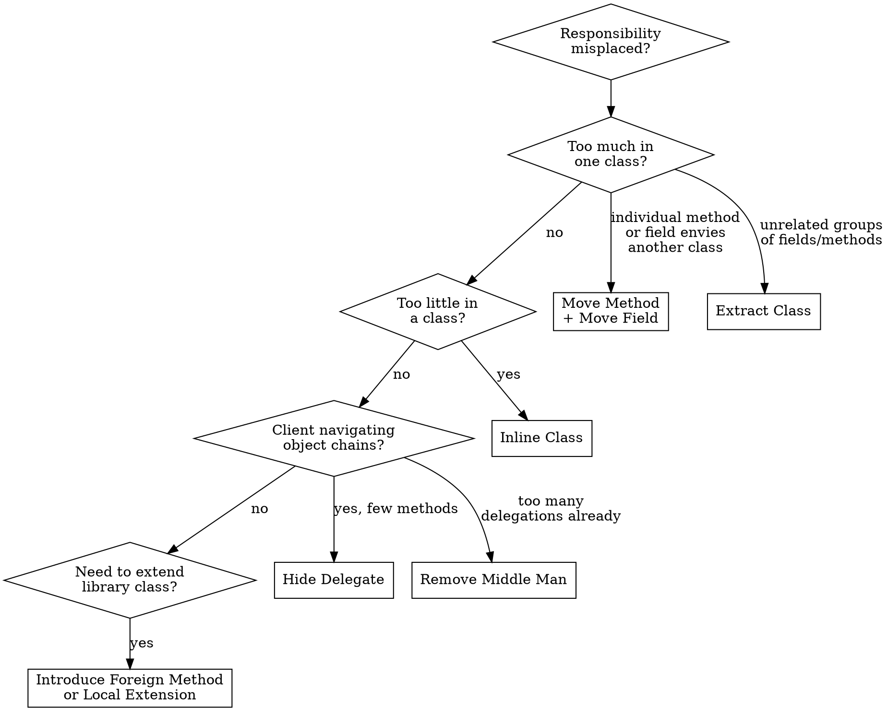

# Refactor: Moving Features Between Objects

## Overview

These 8 techniques redistribute responsibilities between classes. They address "which class should own this behavior?" — reducing coupling, increasing cohesion, and focusing each class on a single responsibility.

## When to Use

- A method uses more data from another class than its own (Feature Envy)
- A class has grown too large with unrelated responsibilities (Large Class, Divergent Change)
- A class is too thin to justify its existence (Lazy Class)
- One change requires edits in many classes (Shotgun Surgery)
- Client code navigates through object chains (Message Chains)

## Quick Reference

| Technique | Problem | Solution |
|-----------|---------|----------|
| Move Method | Method uses another class more than its own | Move to the class it envies |
| Move Field | Field used more by another class | Move to the class that uses it most |
| Extract Class | One class doing the work of two | Split into two focused classes |
| Inline Class | Class does too little | Merge into another class |
| Hide Delegate | Client calls through chain to reach another object | Create delegating methods on the first object |
| Remove Middle Man | Too many delegating methods | Let client call delegate directly |
| Introduce Foreign Method | Need a method on a library class you can't modify | Utility method with the class as first param |
| Introduce Local Extension | Need several methods on unmodifiable class | Create a wrapper or subclass |

## Techniques in Detail

### 1. Move Method

The most common fix for Feature Envy.

**Before:**
```typescript
class Account {
  overdraftCharge(daysOverdrawn: number): number {
    if (this.type.isPremium()) {
      const baseCharge = 10;
      if (daysOverdrawn <= 7) return baseCharge;
      return baseCharge + (daysOverdrawn - 7) * 0.85;
    }
    return daysOverdrawn * 1.75;
  }
}
```

**After:**
```typescript
class AccountType {
  overdraftCharge(daysOverdrawn: number): number {
    if (this.isPremium()) {
      const baseCharge = 10;
      if (daysOverdrawn <= 7) return baseCharge;
      return baseCharge + (daysOverdrawn - 7) * 0.85;
    }
    return daysOverdrawn * 1.75;
  }
}

class Account {
  overdraftCharge(daysOverdrawn: number): number {
    return this.type.overdraftCharge(daysOverdrawn);
  }
}
```

### 2. Move Field

**Before:**
```typescript
class Customer {
  readonly discountRate: number;
}

class Billing {
  calculateDiscount(customer: Customer, amount: number): number {
    return amount * customer.discountRate;
  }
}
```

**After:**
```typescript
class Billing {
  readonly discountRate: number;
  calculateDiscount(amount: number): number {
    return amount * this.discountRate;
  }
}
```

### 3. Extract Class

**Sign:** You can describe what the class does only with "and" (manages users AND sends emails AND generates reports).

**Before:**
```typescript
class Person {
  readonly name: string;
  readonly officeAreaCode: string;
  readonly officeNumber: string;

  telephoneNumber(): string {
    return `(${this.officeAreaCode}) ${this.officeNumber}`;
  }
}
```

**After:**
```typescript
class TelephoneNumber {
  constructor(readonly areaCode: string, readonly number: string) {}
  toString(): string { return `(${this.areaCode}) ${this.number}`; }
}

class Person {
  readonly name: string;
  readonly officeTelephone: TelephoneNumber;
  telephoneNumber(): string { return this.officeTelephone.toString(); }
}
```

### 4. Inline Class

Reverse of Extract Class -- for Lazy Classes. Move all features into the absorbing class, delete the empty one.

### 5. Hide Delegate

Enforces Law of Demeter.

**Before:**
```typescript
const manager = person.department.manager;
```

**After:**
```typescript
class Person {
  get manager(): Employee { return this.department.manager; }
}
const manager = person.manager;
```

**Trade-off:** Too many delegating methods creates a Middle Man.

### 6. Remove Middle Man

Reverse of Hide Delegate -- when the class is nothing but delegations.

**Before:**
```typescript
class Person {
  get manager(): Employee { return this.department.manager; }
  get budget(): number { return this.department.budget; }
  get location(): string { return this.department.location; }
  get headCount(): number { return this.department.headCount; }
}
```

**After:**
```typescript
class Person {
  get department(): Department { return this._department; }
}
const manager = person.department.manager;
```

### 7. Introduce Foreign Method

For one method on an unmodifiable class:

```typescript
function nextDay(date: Date): Date {
  return new Date(date.getFullYear(), date.getMonth(), date.getDate() + 1);
}
```

### 8. Introduce Local Extension

For several methods on an unmodifiable class -- create a wrapper:

```typescript
class ExtendedDate {
  constructor(private readonly date: Date) {}
  nextDay(): Date {
    return new Date(this.date.getFullYear(), this.date.getMonth(), this.date.getDate() + 1);
  }
  isWeekend(): boolean {
    const day = this.date.getDay();
    return day === 0 || day === 6;
  }
}
```

## Decision Flowchart



## Common Mistakes

| Mistake | Fix |
|---------|-----|
| Moving method without moving related data | Move field first, then method -- or both together |
| Extracting class without a clear cohesive concept | If you can't name it, don't extract it |
| Over-applying Hide Delegate until Middle Man emerges | Monitor ratio of delegating to non-delegating methods |
| Breaking encapsulation by making internal delegates public | Only expose what clients genuinely need |
| Forgetting to update all callers after a move | Use IDE "find usages" and run full test suite |
