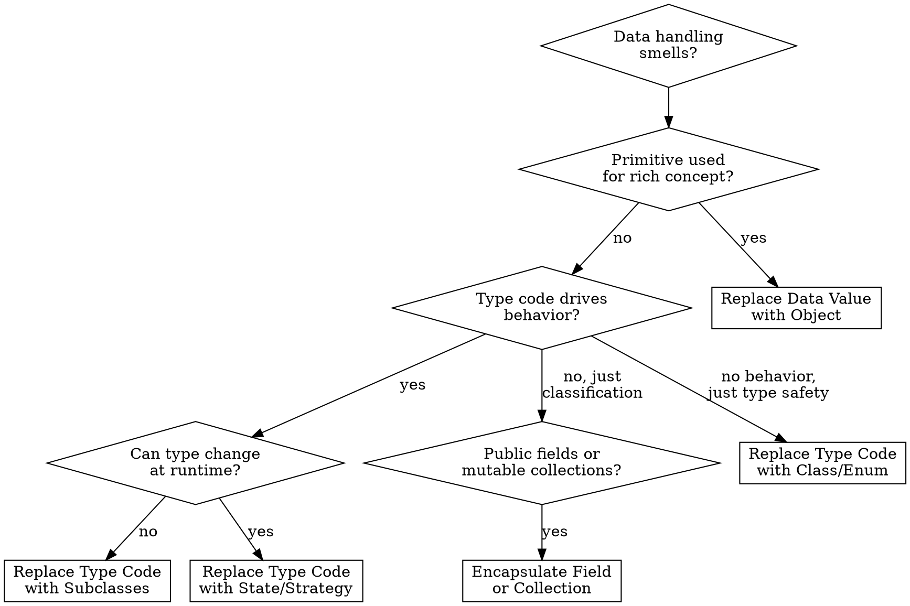

# Refactor: Organizing Data

## Overview

These 15 techniques improve how data is represented, accessed, and managed. They address Primitive Obsession, Data Class, Data Clumps, and Temporary Field smells by introducing proper encapsulation, replacing type codes with polymorphism, and managing object associations correctly.

## When to Use

- Primitives where value objects would be better (phone numbers as strings, money as floats)
- Type codes drive switch statements across the codebase
- Public fields accessed directly without control
- Data clumps (same group of variables passed around together)
- Classes with only fields and getters/setters but no behavior
- Fields only set under certain conditions (Temporary Field)

## Quick Reference

| Technique | Problem | Solution |
|-----------|---------|----------|
| Self Encapsulate Field | Direct field access complicates subclassing/validation | Access own fields through getters/setters |
| Replace Data Value with Object | Primitive carries meaning beyond its type | Create a value object class |
| Change Value to Reference | Duplicate objects that should be one shared instance | Use a registry/lookup to share instances |
| Change Reference to Value | Reference object is simple and immutable | Value object (equality by content) |
| Replace Array with Object | Array elements mean different things by position | Object with named fields |
| Duplicate Observed Data | Domain data trapped in UI class | Copy to domain object, sync with Observer |
| Change Unidirectional to Bidirectional | Two classes need to reference each other | Add back-pointer, manage from one side |
| Change Bidirectional to Unidirectional | Bidirectional adds unnecessary complexity | Drop one direction, use lookup |
| Replace Magic Number with Constant | Literal number with special meaning | Named constant |
| Encapsulate Field | Public field | Make private, add getter |
| Encapsulate Collection | Getter returns mutable collection | Return read-only copy, add/remove methods |
| Replace Type Code with Class | Type code is simple classification (no behavior change) | Class or enum with type safety |
| Replace Type Code with Subclasses | Type code affects behavior | Subclass per type |
| Replace Type Code with State/Strategy | Type code changes at runtime or can't subclass | State or Strategy pattern |
| Replace Subclass with Fields | Subclasses differ only in constant data | Fields in parent, remove subclasses |

## Techniques in Detail

### Replace Data Value with Object

Primary fix for Primitive Obsession.

**Before:**
```typescript
class Order {
  constructor(readonly customerName: string) {}
}
```

**After:**
```typescript
class Customer {
  constructor(readonly name: string) {}
  isPreferred(): boolean { return this.totalOrders() > 10; }
}

class Order {
  constructor(readonly customer: Customer) {}
}
```

### Encapsulate Field / Encapsulate Collection

**Encapsulate Field:**
```typescript
// Before: public, mutable
class Person { name: string; }

// After
class Person {
  private _name: string;
  get name(): string { return this._name; }
}
```

**Encapsulate Collection (immutable pattern):**
```typescript
class Course {
  get students(): readonly Student[] { return [...this._students]; }

  addStudent(student: Student): Course {
    return new Course([...this._students, student]);  // returns new instance
  }

  removeStudent(student: Student): Course {
    return new Course(this._students.filter(s => s !== student));
  }
}
```

### Replace Magic Number with Constant

```typescript
// Before
return mass * 299792458 ** 2;

// After
const SPEED_OF_LIGHT_M_S = 299792458;
return mass * SPEED_OF_LIGHT_M_S ** 2;
```

### Replace Type Code with Subclasses

Use when type code affects behavior.

**Before:**
```typescript
class Employee {
  constructor(readonly type: "engineer" | "manager" | "salesman") {}

  calculatePay(): number {
    switch (this.type) {
      case "engineer": return this.baseSalary;
      case "manager": return this.baseSalary + this.bonus;
      case "salesman": return this.baseSalary + this.commission;
    }
  }
}
```

**After:**
```typescript
abstract class Employee {
  abstract calculatePay(): number;
}

class Engineer extends Employee {
  calculatePay(): number { return this.baseSalary; }
}

class Manager extends Employee {
  calculatePay(): number { return this.baseSalary + this.bonus; }
}

class Salesman extends Employee {
  calculatePay(): number { return this.baseSalary + this.commission; }
}
```

### Replace Type Code with State/Strategy

Use when: (a) type can change at runtime, or (b) class is already subclassed.

**After:**
```typescript
interface EmployeeType {
  calculatePay(employee: Employee): number;
}

class FullTimeType implements EmployeeType {
  calculatePay(employee: Employee): number { return employee.baseSalary; }
}

class PartTimeType implements EmployeeType {
  calculatePay(employee: Employee): number {
    return employee.baseSalary * employee.hoursWorked / 40;
  }
}

class Employee {
  constructor(private employeeType: EmployeeType) {}
  changeType(newType: EmployeeType): Employee { return new Employee(newType); }
  calculatePay(): number { return this.employeeType.calculatePay(this); }
}
```

### Replace Subclass with Fields

When subclasses only differ in constant-returning methods:

```typescript
// Before: Male extends Person, Female extends Person (just return constants)

// After
class Person {
  constructor(private readonly _isMale: boolean, private readonly _code: string) {}
  static createMale(): Person { return new Person(true, "M"); }
  static createFemale(): Person { return new Person(false, "F"); }
  isMale(): boolean { return this._isMale; }
  getCode(): string { return this._code; }
}
```

### Change Value to Reference / Change Reference to Value

**Value -> Reference** when multiple objects should share state:
```typescript
class CustomerRegistry {
  private static readonly customers = new Map<string, Customer>();
  static get(id: string): Customer { return this.customers.get(id)!; }
}
```

**Reference -> Value** when object is simple and immutable:
```typescript
class Money {
  constructor(readonly amount: number, readonly currency: string) {}
  equals(other: Money): boolean {
    return this.amount === other.amount && this.currency === other.currency;
  }
}
```

### Replace Array with Object

```typescript
// Before
const row = ["Liverpool", 15, 3];  // What does each position mean?

// After
const row: TeamPerformance = { name: "Liverpool", wins: 15, losses: 3 };
```

## Decision Flowchart



## Common Mistakes

| Mistake | Fix |
|---------|-----|
| Creating mutable value objects | Value objects must be immutable -- all fields `readonly`, return new instances |
| Using subclasses when type can change at runtime | Use State/Strategy pattern instead |
| Exposing mutable internal collections | Always return copies or read-only views |
| Over-encapsulating simple data structures | Plain `readonly` properties on interfaces don't need getter methods |
| Type hierarchies for types without behavior differences | Use a simple enum or class -- subclasses need distinct behavior |
