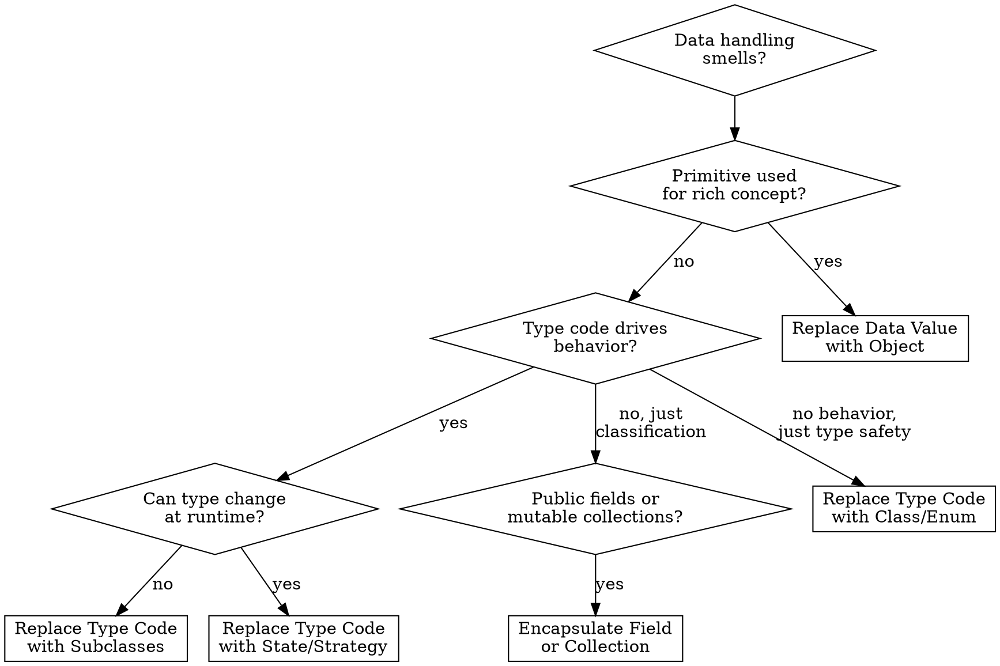

# Refactor: Organizing Data

## Overview

These 15 techniques improve how data is represented, accessed, and managed. They address Primitive Obsession, Data Class, Data Clumps, and Temporary Field smells by introducing proper encapsulation, replacing type codes with polymorphism, and managing object associations correctly.

## When to Use

- Primitives used where value objects would be better (phone numbers as strings, money as floats)
- Type codes drive switch statements across the codebase
- Public fields accessed directly without control
- Data clumps (same group of variables passed around together)
- Classes with only fields and getters/setters but no behavior
- Fields only set under certain conditions (Temporary Field)

## Quick Reference

| Technique | Problem | Solution |
|-----------|---------|----------|
| Self Encapsulate Field | Direct field access complicates subclassing or validation | Access own fields through getters/setters |
| Replace Data Value with Object | Primitive carries meaning beyond its type | Create a value object class |
| Change Value to Reference | Many duplicate objects that should be one shared instance | Use a registry/lookup to share instances |
| Change Reference to Value | Reference object is simple and immutable | Make it a value object (equality by content, not identity) |
| Replace Array with Object | Array with elements meaning different things by position | Create an object with named fields |
| Duplicate Observed Data | Domain data trapped in UI class | Copy data to domain object, sync with Observer |
| Change Unidirectional to Bidirectional | Two classes need to reference each other | Add back-pointer, manage from one side |
| Change Bidirectional to Unidirectional | Bidirectional association adds unnecessary complexity | Drop one direction, use lookup instead |
| Replace Magic Number with Constant | Literal number with special meaning | Extract into a named constant |
| Encapsulate Field | Public field | Make private, add getter (and setter only if needed) |
| Encapsulate Collection | Getter returns mutable collection | Return read-only copy, add/remove methods |
| Replace Type Code with Class | Type code is a simple classification (no behavior change) | Create a class or enum with type safety |
| Replace Type Code with Subclasses | Type code affects behavior | Create subclass per type |
| Replace Type Code with State/Strategy | Type code changes at runtime or class can't be subclassed | Use State or Strategy pattern |
| Replace Subclass with Fields | Subclasses differ only in constant data | Replace with fields in parent, remove subclasses |

## Techniques in Detail

### Replace Data Value with Object

The primary fix for Primitive Obsession.

**Before:**
```typescript
class Order {
  constructor(readonly customerName: string) {}
}
```

**After:**
```typescript
class Customer {
  constructor(readonly name: string) {}

  // behavior that belongs with customer data lives here
  isPreferred(): boolean {
    return this.totalOrders() > 10;
  }
}

class Order {
  constructor(readonly customer: Customer) {}
}
```

**Steps:**
1. Create a class for the value with the primitive as a field
2. Add any validation or behavior that belongs with that data
3. Replace the primitive field with the new class
4. Update all references
5. Run tests

### Encapsulate Field / Encapsulate Collection

**Encapsulate Field — Before:**
```typescript
class Person {
  name: string;  // public, mutable
}
```

**After:**
```typescript
class Person {
  private _name: string;
  get name(): string { return this._name; }
}
```

**Encapsulate Collection — Before:**
```typescript
class Course {
  get students(): Student[] { return this._students; }  // exposes mutable array
}
```

**After:**
```typescript
class Course {
  get students(): readonly Student[] { return [...this._students]; }

  addStudent(student: Student): Course {
    return new Course([...this._students, student]);  // immutable — returns new instance
  }

  removeStudent(student: Student): Course {
    return new Course(this._students.filter(s => s !== student));
  }
}
```

Note: The immutable pattern above aligns with coding style requirements — never mutate, always return new objects.

### Replace Magic Number with Constant

**Before:**
```typescript
function calculateEnergy(mass: number): number {
  return mass * 299792458 ** 2;
}
```

**After:**
```typescript
const SPEED_OF_LIGHT_M_S = 299792458;

function calculateEnergy(mass: number): number {
  return mass * SPEED_OF_LIGHT_M_S ** 2;
}
```

### Replace Type Code with Subclasses

Use when the type code affects behavior (e.g., different employee types calculate pay differently).

**Before:**
```typescript
class Employee {
  constructor(readonly type: "engineer" | "manager" | "salesman") {}

  calculatePay(): number {
    switch (this.type) {
      case "engineer": return this.baseSalary;
      case "manager": return this.baseSalary + this.bonus;
      case "salesman": return this.baseSalary + this.commission;
    }
  }
}
```

**After:**
```typescript
abstract class Employee {
  abstract calculatePay(): number;
}

class Engineer extends Employee {
  calculatePay(): number { return this.baseSalary; }
}

class Manager extends Employee {
  calculatePay(): number { return this.baseSalary + this.bonus; }
}

class Salesman extends Employee {
  calculatePay(): number { return this.baseSalary + this.commission; }
}
```

### Replace Type Code with State/Strategy

Use instead of subclasses when: (a) the type can change at runtime, or (b) the class is already a subclass and can't be further subclassed.

**Before:**
```typescript
class Employee {
  type: "fullTime" | "partTime";  // can change!

  calculatePay(): number {
    switch (this.type) { /* ... */ }
  }
}
```

**After:**
```typescript
interface EmployeeType {
  calculatePay(employee: Employee): number;
}

class FullTimeType implements EmployeeType {
  calculatePay(employee: Employee): number {
    return employee.baseSalary;
  }
}

class PartTimeType implements EmployeeType {
  calculatePay(employee: Employee): number {
    return employee.baseSalary * employee.hoursWorked / 40;
  }
}

class Employee {
  constructor(private employeeType: EmployeeType) {}

  changeType(newType: EmployeeType): Employee {
    return new Employee(newType);  // immutable — returns new instance
  }

  calculatePay(): number {
    return this.employeeType.calculatePay(this);
  }
}
```

### Replace Subclass with Fields

The reverse — when subclasses only differ in constant-returning methods.

**Before:**
```typescript
abstract class Person {
  abstract isMale(): boolean;
  abstract getCode(): string;
}
class Male extends Person {
  isMale() { return true; }
  getCode() { return "M"; }
}
class Female extends Person {
  isMale() { return false; }
  getCode() { return "F"; }
}
```

**After:**
```typescript
class Person {
  constructor(
    private readonly _isMale: boolean,
    private readonly _code: string
  ) {}

  static createMale(): Person { return new Person(true, "M"); }
  static createFemale(): Person { return new Person(false, "F"); }

  isMale(): boolean { return this._isMale; }
  getCode(): string { return this._code; }
}
```

### Change Value to Reference / Change Reference to Value

**Value → Reference** when multiple objects represent the same real-world entity and should share state:
```typescript
// Registry pattern
class CustomerRegistry {
  private static readonly customers = new Map<string, Customer>();

  static get(id: string): Customer {
    return this.customers.get(id)!;
  }
}
```

**Reference → Value** when the object is simple, immutable, and equality should be by content:
```typescript
class Money {
  constructor(readonly amount: number, readonly currency: string) {}

  equals(other: Money): boolean {
    return this.amount === other.amount && this.currency === other.currency;
  }
}
```

### Replace Array with Object

**Before:**
```typescript
const row = ["Liverpool", 15, 3];  // What does each position mean?
```

**After:**
```typescript
interface TeamPerformance {
  readonly name: string;
  readonly wins: number;
  readonly losses: number;
}

const row: TeamPerformance = { name: "Liverpool", wins: 15, losses: 3 };
```

## Decision Flowchart



## Common Mistakes

| Mistake | Fix |
|---------|-----|
| Creating value objects that are mutable | Value objects must be immutable — all fields `readonly`, return new instances |
| Using subclasses when the type can change at runtime | Use State/Strategy pattern instead |
| Exposing mutable internal collections | Always return copies or read-only views |
| Over-encapsulating simple data structures | Plain `readonly` properties on interfaces don't need getter methods |
| Creating type hierarchies for types without behavior differences | Use a simple enum or class — subclasses need distinct behavior to justify their existence |
