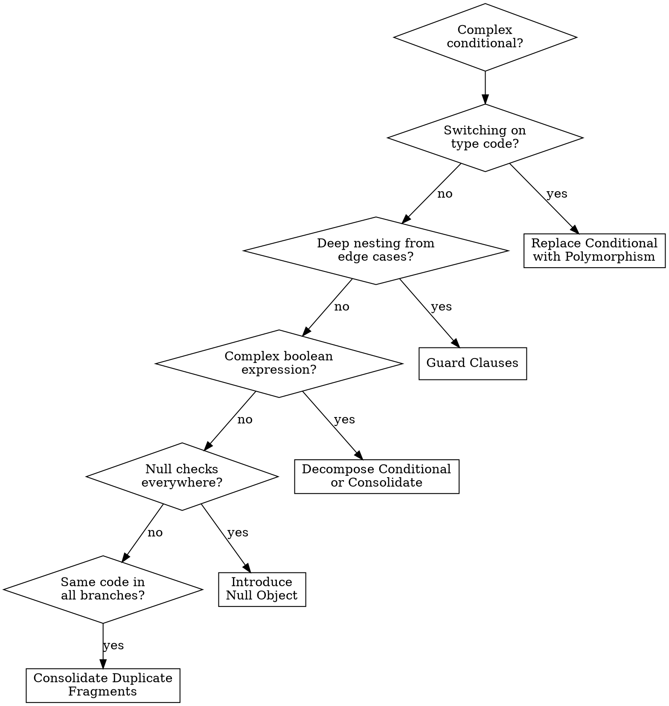

# Refactor: Simplifying Conditional Expressions

## Overview

These 8 techniques flatten, clarify, and eliminate conditional logic. Complex conditionals are a major source of bugs. Goal: make each branch's purpose obvious, eliminate duplication across branches, and replace type-switching with polymorphism.

## When to Use

- Nested if/else deeper than 2 levels
- Same condition checked in multiple places
- Switch statements on type codes that grow with each new type
- Complex boolean expressions
- Null checks scattered throughout

## Quick Reference

| Technique | Problem | Solution |
|-----------|---------|----------|
| Decompose Conditional | Complex condition with big then/else blocks | Extract condition and branches into named methods |
| Consolidate Conditional | Multiple conditions with same result | Combine into single condition with descriptive name |
| Consolidate Duplicate Fragments | Same code in every branch | Move shared code outside the conditional |
| Remove Control Flag | Boolean controls loop flow | Use `break`, `return`, or `continue` |
| Guard Clauses | Deep nesting from special-case checks | Handle edge cases early with `return` |
| Replace Conditional with Polymorphism | Switch on type drives different behavior | Subclass or strategy per type |
| Introduce Null Object | Null checks repeated before using an object | Null/Default implementation that does nothing |
| Introduce Assertion | Code assumes a condition but doesn't check it | Explicit assertion to document and enforce |

## Techniques in Detail

### 1. Decompose Conditional

**Before:**
```typescript
function calculateCharge(date: Date, quantity: number, plan: Plan): number {
  if (date.getMonth() >= 6 && date.getMonth() <= 8) {
    return quantity * plan.summerRate + plan.summerServiceCharge;
  } else {
    return quantity * plan.regularRate + plan.regularServiceCharge;
  }
}
```

**After:**
```typescript
function calculateCharge(date: Date, quantity: number, plan: Plan): number {
  return isSummer(date) ? summerCharge(quantity, plan) : regularCharge(quantity, plan);
}

function isSummer(date: Date): boolean {
  return date.getMonth() >= 6 && date.getMonth() <= 8;
}

function summerCharge(quantity: number, plan: Plan): number {
  return quantity * plan.summerRate + plan.summerServiceCharge;
}

function regularCharge(quantity: number, plan: Plan): number {
  return quantity * plan.regularRate + plan.regularServiceCharge;
}
```

### 2. Consolidate Conditional Expression

**Before:**
```typescript
function disabilityAmount(employee: Employee): number {
  if (employee.seniority < 2) return 0;
  if (employee.monthsDisabled > 12) return 0;
  if (employee.isPartTime) return 0;
  // compute disability amount...
}
```

**After:**
```typescript
function disabilityAmount(employee: Employee): number {
  if (isNotEligibleForDisability(employee)) return 0;
  // compute disability amount...
}

function isNotEligibleForDisability(employee: Employee): boolean {
  return employee.seniority < 2
    || employee.monthsDisabled > 12
    || employee.isPartTime;
}
```

### 3. Consolidate Duplicate Conditional Fragments

```typescript
// Before
if (isSpecialDeal) {
  total = price * 0.95;
  send();
} else {
  total = price * 0.98;
  send();
}

// After
total = isSpecialDeal ? price * 0.95 : price * 0.98;
send();
```

### 4. Remove Control Flag

```typescript
// Before
let found = false;
for (const person of people) {
  if (!found) {
    if (person === "Don" || person === "John") {
      result = person; found = true;
    }
  }
}

// After
for (const person of people) {
  if (person === "Don" || person === "John") return person;
}
return "";
```

### 5. Guard Clauses

One of the most impactful simplifications. Handle edge cases early, keep main logic flat.

**Before:**
```typescript
function getPayAmount(employee: Employee): number {
  if (employee.isSeparated) {
    return separatedAmount();
  } else {
    if (employee.isRetired) {
      return retiredAmount();
    } else {
      return normalPayAmount();
    }
  }
}
```

**After:**
```typescript
function getPayAmount(employee: Employee): number {
  if (employee.isSeparated) return separatedAmount();
  if (employee.isRetired) return retiredAmount();
  return normalPayAmount();
}
```

**Rule:** If one branch is a special case, use a guard clause. If both branches are equally important, use if/else.

### 6. Replace Conditional with Polymorphism

The most powerful technique -- eliminates switch statements that grow with each new type.

**Before:**
```typescript
function calculateArea(shape: Shape): number {
  switch (shape.type) {
    case "circle": return Math.PI * shape.radius ** 2;
    case "rectangle": return shape.width * shape.height;
    case "triangle": return (shape.base * shape.height) / 2;
    default: throw new Error(`Unknown shape: ${shape.type}`);
  }
}
```

**After:**
```typescript
interface Shape { calculateArea(): number; }

class Circle implements Shape {
  constructor(private readonly radius: number) {}
  calculateArea(): number { return Math.PI * this.radius ** 2; }
}

class Rectangle implements Shape {
  constructor(private readonly width: number, private readonly height: number) {}
  calculateArea(): number { return this.width * this.height; }
}

class Triangle implements Shape {
  constructor(private readonly base: number, private readonly height: number) {}
  calculateArea(): number { return (this.base * this.height) / 2; }
}
```

**Apply when:** Same switch appears in multiple methods, new types require updating multiple switches, branches have substantially different logic.

**Skip when:** Simple one-off conditionals, condition based on dynamic data not type identity, single switch unlikely to grow.

### 7. Introduce Null Object

**Before:**
```typescript
function getDiscount(customer: Customer | null): number {
  if (customer === null) return 0;
  return customer.getDiscount();
}
```

**After:**
```typescript
class NullCustomer implements Customer {
  get name(): string { return "occupant"; }
  getDiscount(): number { return 0; }
  isNull(): boolean { return true; }
}
// No null checks needed -- all client code just calls methods
```

Only use when "do nothing" is valid behavior, not when null indicates an error.

### 8. Introduce Assertion

```typescript
function calculateExpense(project: Project): number {
  console.assert(project.members.length > 0, "Project must have members");
  return project.budget / project.members.length;
}
```

Assertions for conditions that should *never* be false in correct code. Validation for user input and external data.

## Decision Flowchart



## Common Mistakes

| Mistake | Fix |
|---------|-----|
| Replacing ALL conditionals with polymorphism | Only replace switches that appear in multiple places or will grow |
| Guard clauses that obscure main logic | Guard clauses are for edge cases -- if all paths are equally important, use if/else |
| Null Object that hides bugs | Only use when "do nothing" is valid, not when null indicates an error |
| Over-decomposing simple conditions | `if (x > 0)` doesn't need extraction |
| Removing control flags but introducing complex booleans | Sometimes a control flag IS clearest -- refactor only when it simplifies |
