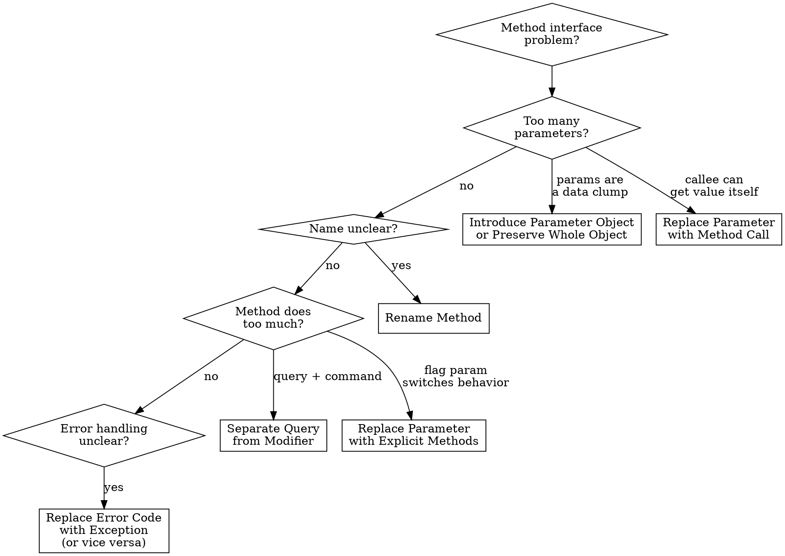

# Refactor: Simplifying Method Calls

## Overview

These 14 techniques improve method interfaces -- making them easier to understand, call correctly, and maintain. Clean method signatures are your code's API contract; unclear signatures lead to misuse and tight coupling.

## When to Use

- Method name doesn't describe what it does
- 4+ parameters
- Boolean flag parameters switch behavior
- Caller extracts data just to pass as parameters
- Method does both query and command (side effects + return value)

## Quick Reference

| Technique | Problem | Solution |
|-----------|---------|----------|
| Rename Method | Name doesn't communicate intent | Descriptive name |
| Add Parameter | Method needs additional data | Add parameter (consider alternatives first) |
| Remove Parameter | Parameter unused | Delete it |
| Separate Query from Modifier | Returns value AND changes state | Split into query + command |
| Parameterize Method | Multiple methods do same thing with different values | One method with a parameter |
| Replace Parameter with Explicit Methods | Parameter switches between different behaviors | Separate method per value |
| Preserve Whole Object | Extracting values from object to pass as params | Pass the whole object |
| Replace Parameter with Method Call | Callee can obtain the value itself | Callee gets value directly |
| Introduce Parameter Object | Same group of params appears together | Bundle into an object |
| Remove Setting Method | Field should not change after creation | Remove setter, set in constructor |
| Hide Method | Method not used outside its class | Make private |
| Replace Constructor with Factory Method | Constructor too limited | Factory method |
| Replace Error Code with Exception | Special return values indicate errors | Throw exceptions |
| Replace Exception with Test | Exception used for control flow | Check condition before calling |

## Techniques in Detail

### 1. Rename Method

The simplest and most valuable refactoring.

```typescript
// Before
function dt(d1: Date, d2: Date): number { /* ... */ }

// After
function daysBetween(start: Date, end: Date): number { /* ... */ }
```

### 2. Separate Query from Modifier (Command Query Separation)

A method should either return a value OR have a side effect, never both.

**Before:**
```typescript
function getTotalAndSendInvoice(order: Order): number {
  const total = order.items.reduce((sum, i) => sum + i.price, 0);
  emailService.sendInvoice(order, total);
  return total;
}
```

**After:**
```typescript
function getTotal(order: Order): number {
  return order.items.reduce((sum, i) => sum + i.price, 0);
}

function sendInvoice(order: Order): void {
  emailService.sendInvoice(order, getTotal(order));
}
```

### 3. Parameterize Method

```typescript
// Before
function tenPercentRaise(employee: Employee): Employee {
  return { ...employee, salary: employee.salary * 1.1 };
}
function fivePercentRaise(employee: Employee): Employee {
  return { ...employee, salary: employee.salary * 1.05 };
}

// After
function raise(employee: Employee, percentage: number): Employee {
  return { ...employee, salary: employee.salary * (1 + percentage / 100) };
}
```

### 4. Replace Parameter with Explicit Methods

Reverse of Parameterize -- when parameter selects fundamentally different behaviors.

```typescript
// Before
function setValue(name: string, value: number): void {
  if (name === "height") this._height = value;
  else if (name === "width") this._width = value;
}

// After
function setHeight(value: number): void { this._height = value; }
function setWidth(value: number): void { this._width = value; }
```

**Rule:** Parameter is a *value* -> parameterize. Parameter selects a *behavior* -> explicit methods.

### 5. Preserve Whole Object

```typescript
// Before
const low = daysTempRange.getLow();
const high = daysTempRange.getHigh();
const withinPlan = plan.withinRange(low, high);

// After
const withinPlan = plan.withinRange(daysTempRange);
```

**Caution:** Don't introduce a new dependency between classes that shouldn't know about each other.

### 6. Replace Parameter with Method Call

```typescript
// Before
const discount = getDiscount();
const finalPrice = discountedPrice(basePrice, discount);

// After
const finalPrice = discountedPrice(basePrice);

function discountedPrice(basePrice: number): number {
  return basePrice * (1 - getDiscount());
}
```

### 7. Introduce Parameter Object

**Before:**
```typescript
function amountInvoiced(startDate: Date, endDate: Date): number { /* ... */ }
function amountReceived(startDate: Date, endDate: Date): number { /* ... */ }
function amountOverdue(startDate: Date, endDate: Date): number { /* ... */ }
```

**After:**
```typescript
interface DateRange { readonly start: Date; readonly end: Date; }

function amountInvoiced(range: DateRange): number { /* ... */ }
function amountReceived(range: DateRange): number { /* ... */ }
function amountOverdue(range: DateRange): number { /* ... */ }
```

Move behavior that operates on these parameters into the object to avoid Data Class smell.

### 8. Remove Setting Method

Critical for immutability.

```typescript
// Before
class Employee {
  private _id: string;
  setId(id: string): void { this._id = id; }
  getId(): string { return this._id; }
}

// After
class Employee {
  constructor(private readonly _id: string) {}
  get id(): string { return this._id; }
}
```

### 9. Replace Constructor with Factory Method

```typescript
// Before
class Employee {
  constructor(private readonly type: "engineer" | "manager") {}
}

// After
class Employee {
  private constructor(private readonly type: string) {}
  static createEngineer(): Employee { return new Employee("engineer"); }
  static createManager(): Employee { return new Employee("manager"); }
}
```

### 10. Replace Error Code with Exception

```typescript
// Before
function withdraw(amount: number): number {
  if (amount > this.balance) return -1;  // what does -1 mean?
  this.balance -= amount;
  return 0;
}

// After
function withdraw(amount: number): void {
  if (amount > this.balance) throw new InsufficientFundsError(amount, this.balance);
  this.balance -= amount;
}
```

### 11. Replace Exception with Test

Don't use exceptions for expected conditions.

```typescript
// Before
try { return values[periodNumber]; }
catch (e) { return 0; }

// After
if (periodNumber >= values.length) return 0;
return values[periodNumber];
```

**Rule:** Exceptions for unexpected failures. Conditionals for expected conditions.

### 12. Hide Method

If only called within its own class, make it private. Check for external callers first.

## Decision Flowchart



## Common Mistakes

| Mistake | Fix |
|---------|-----|
| Renaming to describe implementation instead of intent | `processData` -> `calculateMonthlyRevenue`, not `loopAndSum` |
| Preserving Whole Object when it creates unwanted dependency | If callee shouldn't know about the object's class, pass specific values |
| Removing setter but leaving backdoor mutation via references | Ensure deep immutability -- freeze or clone nested objects |
| Parameter Objects that are just data bags | Move behavior into the Parameter Object |
| Separating Query from Modifier when they're inherently atomic | If the operation must be atomic (e.g., `pop()`), keep together and document why |
