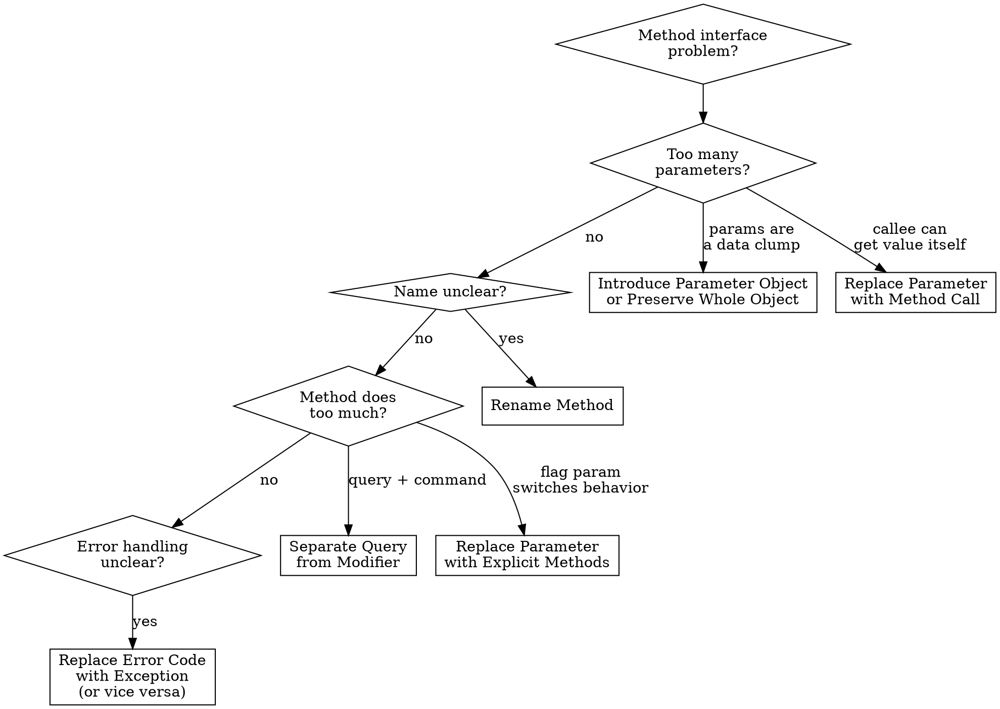

# Refactor: Simplifying Method Calls

## Overview

These 14 techniques improve method interfaces — making them easier to understand, call correctly, and maintain. Clean method signatures are the API contract of your code; unclear signatures lead to misuse, bugs, and tight coupling.

## When to Use

- Method name doesn't describe what it does
- Method has too many parameters (4+)
- Boolean flag parameters switch method behavior
- Caller extracts data just to pass it as parameters
- Getter returns mutable internal state
- Method does both query and command (side effects + return value)
- Constructor is complex or has many parameters

## Quick Reference

| Technique | Problem | Solution |
|-----------|---------|----------|
| Rename Method | Name doesn't communicate intent | Choose a name that describes what it does |
| Add Parameter | Method needs additional data | Add a parameter (consider alternatives first) |
| Remove Parameter | Parameter is unused | Delete it |
| Separate Query from Modifier | Method both returns value and changes state | Split into two: one that queries, one that modifies |
| Parameterize Method | Multiple methods do same thing with different values | One method with a parameter |
| Replace Parameter with Explicit Methods | Method behavior switches on a parameter value | Separate method per value |
| Preserve Whole Object | Extracting values from object to pass as params | Pass the whole object instead |
| Replace Parameter with Method Call | Parameter value can be obtained by the callee | Callee gets the value itself |
| Introduce Parameter Object | Same group of parameters appears together | Bundle into an object |
| Remove Setting Method | Field should not change after creation | Remove the setter, set in constructor |
| Hide Method | Method not used outside its class | Make it private |
| Replace Constructor with Factory Method | Constructor is too limited | Use a factory method for creation |
| Replace Error Code with Exception | Method returns special values to indicate errors | Throw exceptions instead |
| Replace Exception with Test | Exception used for control flow | Check condition before calling |

## Techniques in Detail

### 1. Rename Method

The simplest and most valuable refactoring. A good name eliminates the need for comments.

**Before:**
```typescript
function dt(d1: Date, d2: Date): number { /* ... */ }
```

**After:**
```typescript
function daysBetween(start: Date, end: Date): number { /* ... */ }
```

**Steps:**
1. Choose a name that describes the method's purpose (verb + noun)
2. Create a new method with the new name
3. Copy the body
4. Update all callers
5. Delete the old method
6. Run tests

### 2. Separate Query from Modifier (Command Query Separation)

A method should either return a value OR have a side effect, never both.

**Before:**
```typescript
function getTotalAndSendInvoice(order: Order): number {
  const total = order.items.reduce((sum, i) => sum + i.price, 0);
  emailService.sendInvoice(order, total);
  return total;
}
```

**After:**
```typescript
function getTotal(order: Order): number {
  return order.items.reduce((sum, i) => sum + i.price, 0);
}

function sendInvoice(order: Order): void {
  const total = getTotal(order);
  emailService.sendInvoice(order, total);
}
```

**Why this matters:** Queries can be called safely without side effects. Callers who only need the value don't trigger unwanted actions.

### 3. Parameterize Method

**Before:**
```typescript
function tenPercentRaise(employee: Employee): Employee {
  return { ...employee, salary: employee.salary * 1.1 };
}

function fivePercentRaise(employee: Employee): Employee {
  return { ...employee, salary: employee.salary * 1.05 };
}
```

**After:**
```typescript
function raise(employee: Employee, percentage: number): Employee {
  return { ...employee, salary: employee.salary * (1 + percentage / 100) };
}
```

### 4. Replace Parameter with Explicit Methods

The reverse of Parameterize Method — use when a parameter switches between fundamentally different behaviors.

**Before:**
```typescript
function setValue(name: string, value: number): void {
  if (name === "height") this._height = value;
  else if (name === "width") this._width = value;
}
```

**After:**
```typescript
function setHeight(value: number): void { this._height = value; }
function setWidth(value: number): void { this._width = value; }
```

**When to use which:** If the parameter is truly a *value* (like a percentage), parameterize. If the parameter selects a *behavior*, use explicit methods.

### 5. Preserve Whole Object

**Before:**
```typescript
const low = daysTempRange.getLow();
const high = daysTempRange.getHigh();
const withinPlan = plan.withinRange(low, high);
```

**After:**
```typescript
const withinPlan = plan.withinRange(daysTempRange);
```

**Benefits:** Fewer parameters, resilient to adding new fields, reduces coupling to the object's internal structure at the call site.

**Caution:** Don't do this if it introduces a new dependency between classes that shouldn't know about each other.

### 6. Replace Parameter with Method Call

**Before:**
```typescript
const basePrice = quantity * itemPrice;
const discount = getDiscount();
const finalPrice = discountedPrice(basePrice, discount);
```

**After:**
```typescript
const basePrice = quantity * itemPrice;
const finalPrice = discountedPrice(basePrice);

function discountedPrice(basePrice: number): number {
  const discount = getDiscount();  // callee gets it directly
  return basePrice * (1 - discount);
}
```

### 7. Introduce Parameter Object

**Before:**
```typescript
function amountInvoiced(startDate: Date, endDate: Date): number { /* ... */ }
function amountReceived(startDate: Date, endDate: Date): number { /* ... */ }
function amountOverdue(startDate: Date, endDate: Date): number { /* ... */ }
```

**After:**
```typescript
interface DateRange {
  readonly start: Date;
  readonly end: Date;
}

function amountInvoiced(range: DateRange): number { /* ... */ }
function amountReceived(range: DateRange): number { /* ... */ }
function amountOverdue(range: DateRange): number { /* ... */ }
```

**Steps:**
1. Identify parameter groups that travel together
2. Create an immutable class/interface for them
3. Replace parameter lists with the new object
4. Move behavior that operates on these parameters into the object
5. Run tests

### 8. Remove Setting Method

Critical for immutability. If a field should be set once, remove the setter.

**Before:**
```typescript
class Employee {
  private _id: string;

  setId(id: string): void { this._id = id; }
  getId(): string { return this._id; }
}
```

**After:**
```typescript
class Employee {
  constructor(private readonly _id: string) {}

  get id(): string { return this._id; }
}
```

This directly enforces the immutability principle from coding standards.

### 9. Replace Constructor with Factory Method

**Before:**
```typescript
class Employee {
  constructor(private readonly type: "engineer" | "manager") {}
}
```

**After:**
```typescript
class Employee {
  private constructor(private readonly type: string) {}

  static createEngineer(): Employee {
    return new Employee("engineer");
  }

  static createManager(): Employee {
    return new Employee("manager");
  }
}
```

**When to use:** Complex creation logic, need to return subclasses, want descriptive creation names, or constructor limitations are a problem.

### 10. Replace Error Code with Exception

**Before:**
```typescript
function withdraw(amount: number): number {
  if (amount > this.balance) return -1;  // what does -1 mean?
  this.balance -= amount;
  return 0;
}
```

**After:**
```typescript
function withdraw(amount: number): void {
  if (amount > this.balance) {
    throw new InsufficientFundsError(amount, this.balance);
  }
  this.balance -= amount;
}
```

### 11. Replace Exception with Test

The reverse — don't use exceptions for expected conditions.

**Before:**
```typescript
function getValueForPeriod(periodNumber: number): number {
  try {
    return values[periodNumber];
  } catch (e) {
    return 0;
  }
}
```

**After:**
```typescript
function getValueForPeriod(periodNumber: number): number {
  if (periodNumber >= values.length) return 0;
  return values[periodNumber];
}
```

**Rule:** Exceptions for unexpected failures. Conditionals for expected conditions.

### 12. Hide Method

If a method is only called within its own class, make it private.

**Steps:**
1. Check for external callers (IDE find usages)
2. If none, make private
3. Run tests

## Decision Flowchart



## Common Mistakes

| Mistake | Fix |
|---------|-----|
| Renaming to describe implementation instead of intent | `processData` → `calculateMonthlyRevenue`, not `loopAndSum` |
| Preserving Whole Object when it creates unwanted dependency | If the callee shouldn't know about the object's class, pass specific values |
| Removing a setter but leaving backdoor mutation via references | Ensure deep immutability — freeze or clone nested objects |
| Creating Parameter Objects that are just data bags | Move behavior into the Parameter Object to avoid Data Class smell |
| Separating Query from Modifier when they're inherently atomic | If the operation must be atomic (e.g., `pop()`), keep them together and document why |
